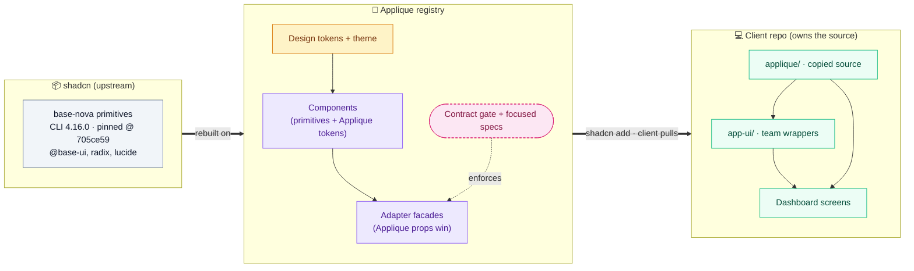

# Applique UI: the registry approach

> A plain-language walkthrough for the engineering team. It explains what we are
> proposing, why we are delivering components as a **registry** instead of an
> **npm package**, what that means for client code, and how we migrate existing
> Applique components with the smallest possible change for clients.
>
> For the deep technical reference, see [REGISTRY.md](./REGISTRY.md). For the
> prop-adapter engine design, see
> [superpowers/specs/2026-08-04-applique-prop-adapter-engine-design.md](./superpowers/specs/2026-08-04-applique-prop-adapter-engine-design.md).

## 1. What we are proposing, in one paragraph

We rebuild Applique's components on top of **shadcn** primitives (the
`base-nova` set) with Applique design tokens, and we ship them through a
**versioned registry** rather than a central npm package. Clients install a
component with one command; the component's **source code is copied into their
repository**, where they own it. Existing Applique components keep working —
migration is opt-in, component by component. Where a legacy component has a
different prop API, a thin **adapter (facade)** preserves the Applique props so
that a migrating client changes an import, not their whole screen.

Clients use one public import path:

```tsx
import { Button } from "@/components/applique/button"
```

The registry follows the same single-name rule: clients install `button.json`,
not a separate `applique-button.json`. The facade owns that public name. Its
pinned shadcn Button is copied under `components/applique/internal` and remains
an implementation detail.

The whole system in one picture — the pieces on each side and the install-time
handoff between them:



The rest of this doc walks through each layer: why a registry (§2–§3), how the
client relies on it and what it must provide (§4–§5), the ownership split (§6),
and how existing components migrate behind the adapter (§7–§8).

## 2. Two ways to ship a design system

There are two realistic ways to deliver shared components to many dashboards.

**An npm package.** We publish `@applique-ui/*`; every dashboard adds it as a
dependency and imports components at runtime. The component code lives inside the
package; the client only sees its public props.

**A registry.** We publish component *source* behind versioned URLs. A client
runs the shadcn CLI, which **copies the source files into their repo**. From that
moment the files are ordinary files in the client's project — the registry is not
involved when the app runs in the browser.

The rest of this doc explains why the registry is the better fit for us.

## 3. Why registry over npm package

The instinct is that an npm package is simpler. But the package's promise —
"upgrade a version number and you're done" — does not actually hold for a UI
library that teams need to customize.

**An npm upgrade is never free.** Even with a package, a client still has to bump
the version, resolve any API changes, retest their dashboard, and redeploy. The
package does not remove that work; it only hides the implementation.

**A package needs a full-time owning team.** Every component, every prop mapping,
every compatibility fix flows through one central package and one release train.
Without a dedicated Applique platform team, that becomes a bottleneck.

**A package limits customization.** A client can only use what the package
exposes. If they need to tweak icon placement or an internal behavior the props
don't reach, they are stuck waiting for a release or writing a brittle override.

The registry inverts these trade-offs:

| | npm package | Registry |
|---|---|---|
| Who owns the component code | The central package | **The client** (source is copied in) |
| Customization | Only via exposed props | Client can read and adjust the actual source |
| Getting an update | Bump version, hope overrides survive | Re-run install, **review the source diff**, accept it |
| Central maintenance burden | High — every component and prop | Lower — primitives stay close to pinned shadcn source |
| Runtime coupling | App depends on the package | App builds its own local source; **registry never ships to the browser** |

The one honest cost: because clients own the source, an update is a **reviewed
diff to merge**, not a silent version bump. We consider that a feature — the
change is visible before it is accepted — but it is a real responsibility, and we
address it in §6 with a folder convention that keeps merges small.

### What happens when the owning team gets thin

This is the real reason registry fits us. Our previous npm library was abandoned
after a few years, and that taught us the actual failure mode: a package creates a
**hard dependency** on a central team. When that team goes away, every consumer is
frozen — they can't upgrade (no releases), can't fix bugs (the code is buried in
`node_modules`), and can't customize beyond the exposed props.

Registry doesn't magically remove maintenance — it **changes what happens when
maintenance stops.** Because the source is already copied into every repo, teams
keep working, editable code even if the center goes quiet. A package fails
*catastrophically*; a registry fails *gracefully*.

| When the owning team disappears | npm package | Registry |
|---|---|---|
| Existing screens | Frozen on the last release | Keep working code they can edit |
| Fixing a bug | Fork `node_modules` (brittle) | Edit the local source, ship today |
| New components | Stop | Stop (same) |

Two honest caveats, so we don't repeat the old mistake:

- **This is not "no maintenance."** Registry lowers the bar; it doesn't remove it.
  Someone still keeps the primitives pinned, the tokens current, and the facades
  green. The win is that a thin team degrades gently instead of freezing everyone.
- **The new long-run risk is drift, not abandonment.** Once source lives in many
  repos and teams edit it, copies diverge and central fixes stop reaching everyone
  automatically. The `applique/` vs `app-ui/` split (§6) is how we keep that in
  check — vendored source stays untouched, customization lives in `app-ui/`.

## 4. How the client relies on it

This is the key mental model: **the registry is a source-delivery channel, not a
runtime service.** The browser never calls it.

```
Registry (versioned URL)
        │  shadcn add   (install time only)
        ▼
Client repo: src/components/applique/button.tsx   ← now an ordinary file they own
        │  normal import
        ▼
Dashboard: import { Button } from "@/components/applique/button"
        │  normal build
        ▼
Production: compiled JS + CSS   ← no registry, no CLI, no Node involved
```

Concretely:

- **Install time:** the CLI copies the component source, its internal primitives,
  the Applique theme/tokens, and the exact npm dependencies into the client repo.
- **Build time:** the client's normal React + Tailwind build compiles those local
  files like any other source.
- **Runtime:** the browser runs compiled JS/CSS. Nothing phones home to Applique.

Publishing a new version does **not** change a client already on an older one.
The client pulls an update deliberately by re-running the install with the new
versioned URL and reviewing the diff.

## 5. Hard dependencies a client must have

Because the source is copied in, the client's own `package.json` and build must
satisfy every dependency the components use. There are two layers: a **core** set
every install needs, and a **per-component** set the CLI adds only when you
install a component that uses it.

**Core — always required (any Applique registry install):**

| Dependency | Version | Phase | Why it is required |
|---|---|---|---|
| Node.js | ≥ 20.18.1 | Install only | Runs the shadcn CLI that copies the source. Not used at runtime. |
| shadcn CLI | 4.16.0 | Install only | The tool that reads the registry and writes files into the repo. |
| React + React DOM | ^18 | Runtime | Peer dependency of every component. |
| Tailwind CSS | 4.x | Build | Components are styled with Tailwind v4 classes; v3 will not compile them. |
| `tw-animate-css` | 1.4.x | Build | Animation utilities the primitives reference. |
| Applique theme (`applique-theme` registry item) | tracks registry | Build/Runtime | Design tokens (`tokens.css`) + `@fontsource-variable/hanken-grotesk`. Without it components render unstyled/mis-tokened. |
| `@base-ui/react` | 1.6.0 | Runtime | The headless primitive engine most components are built on. |
| `@radix-ui/react-slot`, `@radix-ui/react-label` | 1.2.x / 2.1.x | Runtime | `asChild` slotting and accessible labels. |
| `lucide-react` | 1.28.x | Runtime | Default icon set. |
| `class-variance-authority`, `clsx`, `tailwind-merge` | 0.7.x / 2.1.x / 3.6.x | Runtime | The `cn()` helper and variant definitions every component uses. |

**Per-component — added only when you install that component:**

| Extra dependency | Version | Pulled in by |
|---|---|---|
| `@tanstack/react-table` | 8.21.x | Table |
| `recharts` | 3.8.x | Chart |
| `react-day-picker` + `date-fns` | 10.0.x / 4.4.x | Calendar, Date/Month inputs |
| `react-hook-form` | 7.83.x | Form |
| `cmdk` | 1.1.x | Command / Combobox |
| `embla-carousel-react` | 8.6.x | Carousel |
| `input-otp` | 1.4.x | OTP input |
| `sonner` | 2.0.x | Toast |
| `react-resizable-panels` | 4.12.x | Resizable panels |
| `next-themes` | 0.4.x | Theme switcher |

Two things worth calling out:

- **The version numbers are pinned by the registry, not chosen by the client.**
  The CLI writes the exact versions above so the copied source and its
  dependencies stay in lockstep. A client on conflicting majors (e.g. Tailwind 3,
  React 17) cannot use the registry without upgrading first.
- **Node and the shadcn CLI are install-time only.** They never reach the
  browser — the production bundle is just React + the runtime dependencies above.

## 6. Why owning the source is the real benefit

Because the component source lives in the client repo, teams can build on top of
it without waiting on us. The recommended convention keeps shared code and
team-specific code cleanly separated:

```
src/components/
├── applique/          # Registry-managed source — treat as "do not edit"
│   ├── button.tsx
│   └── internal/…
└── app-ui/            # Team-owned wrappers and specialized components
    └── order-action-button.tsx
```

A team-specific component is just a small wrapper around the owned Applique
source:

```tsx
import { Button, type ButtonProps } from "@/components/applique/button"
import { cn } from "@/lib/utils"

export function OrderActionButton({ className, ...props }: ButtonProps) {
  return <Button {...props} className={cn("w-full justify-between", className)} />
}
```

The simple ownership rule:

- **Needed by one app only** → make an `app-ui` wrapper.
- **Useful to every dashboard** → contribute it back to the Applique registry.
- **Urgent and un-wrappable** → edit the `applique/` source as a deliberate, documented fork (you then own that merge).

Keeping team changes in `app-ui/` means re-running an update only touches
`applique/`, so the team's own wrappers are never in the merge. With an npm
package, that same wrapper could only ever use what the package chose to expose;
with the registry, the base implementation is right there to read and build on.

## 7. How we migrate existing components

We do **not** rewrite everything at once, and we do not break existing screens.
Legacy `@applique-ui/*` imports keep working untouched until a team chooses to
migrate a screen. Migration is component by component, ordered by how hard the
component is and how heavily it is used.

We sort every component into four buckets:

| Bucket | Meaning | Examples |
|---|---|---|
| **Direct** | One Applique component maps to one shadcn primitive | InputNumber → Input, Avatar → Avatar, Badge → Badge |
| **Composition** | Needs several primitives plus Applique behavior | Button = Button + Spinner + Badge; InputDate = Calendar + Popover + Input + Button |
| **Ambiguous** | The right target depends on real usage | Dropdown → Select *or* Menu *or* Popover |
| **No equivalent** | Exists on only one side | VirtualList (Applique-only), Carousel (shadcn-only) |

Direct components migrate first and cheapest. Composition components are
hand-built but share common logic. Ambiguous ones get a usage audit before we
pick a target. No-equivalent ones stay as they are.

## 8. The adapter approach: minimum change for clients

The goal for a migrating client is: **change the import, keep your props.** The
old Applique prop API and the new shadcn primitive often disagree — different prop
names, different event shapes — so something has to translate between them. That
translator is the **adapter (facade)**.

Two rules make it predictable:

1. **Applique props are the stable contract.** If both an Applique prop and a
   shadcn prop try to control the same thing, **the Applique prop wins.**
2. **Everything else passes straight through.** Native and extra shadcn props
   (`aria-*`, `data-*`, `className`, …) are forwarded untouched, so clients keep
   their existing markup.

In practice, **every audited prop is sorted into one of five buckets.** This is the
whole of "props migration" — nothing is left to chance, and nothing is dropped
silently. Three buckets keep the client's prop working automatically; two flag it
for a decision (and are always documented, never silent).

**Kept working — the client changes nothing:**

| Bucket | Client writes | What the facade does |
|---|---|---|
| **Forward** | `<Badge className="ml-2" id="x" />` | Passes native/`aria-*`/`data-*` props straight through, untouched |
| **Map** | `<Badge variant="solid" />` | Renames or re-values: sends shadcn `variant="default"`. *(Includes **Constant** — e.g. InputNumber always forces `type="number"`, which the client never passes.)* |
| **Compose** | `<Button loading notifications={3} />` | Builds the structure/behaviour a single prop implies — a Spinner, a count Badge, breadcrumb separators |

**Flagged for a decision — a short, documented "tweak this" list:**

| Bucket | Example | What it means |
|---|---|---|
| **Unsupported** | Button `state` (arbitrary CSS escape hatch) | Deliberately excluded; a client using it gets a documented migration note |
| **Needs-review** | Tabs `type`, Tooltip `triggerOn` | The right shadcn target/behaviour is still an open question, parked for a human |

The full, live list of every flagged prop lives in a separate tracker:
[PENDING-PROPS-REVIEW.md](./PENDING-PROPS-REVIEW.md). It is auto-derived from the
contract data, so it never drifts from the code.

For example, the client can write:

```tsx
<Button
  type="primary"
  loading
  autoFocus
  aria-label="Save"
>
  Save
</Button>
```

Inside the facade, `type` is mapped to the shadcn visual variant, `loading`
creates the Spinner and disabled behavior, and `autoFocus` and `aria-label` are
forwarded unchanged. The client does not need to know about the internal shadcn
Button.

If a client supplies both Applique `type="primary"` and shadcn
`variant="destructive"`, `type` wins because both control the same visual state.
If `type` is omitted, the client may use the non-conflicting shadcn extension:

```tsx
<Button variant="destructive">Delete</Button>
```

InputNumber follows the same approach. The client keeps writing:

```tsx
<InputNumber value={qty} onChange={(n) => setQty(n)} />
```

…and the adapter quietly does the translation the primitive needs — forcing
`type="number"`, normalizing an invalid value to empty, and converting the DOM
event into the number the client's handler expects.

### When one Applique component becomes several shadcn pieces

The "Compose" bucket is where the real work lives. An Applique component is often
*one* thing to the client but *several* pieces underneath. The facade owns
assembling them, so the client never sees the seams.

**Example — BreadCrumb.** Old Applique drew the `/` dividers with CSS; shadcn
needs an explicit `<BreadcrumbSeparator>` element between items. The client keeps
writing a plain list:

```tsx
<BreadCrumb>
  <BreadCrumb.Item><a href="/">Home</a></BreadCrumb.Item>
  <BreadCrumb.Item>Orders</BreadCrumb.Item>
</BreadCrumb>
```

…and the facade renders the shadcn structure, inserting a separator between every
pair for them:

```tsx
<Breadcrumb>
  <BreadcrumbList>
    <BreadcrumbItem><a href="/">Home</a></BreadcrumbItem>
    <BreadcrumbSeparator />          {/* facade adds this */}
    <BreadcrumbItem>Orders</BreadcrumbItem>
  </BreadcrumbList>
</Breadcrumb>
```

**Example — Button.** `<Button loading notifications={3}>Save</Button>` is really
three shadcn pieces glued together: the shadcn **Button**, a **Spinner** (only
while loading), and a **Badge** for the "3" (capped at "99+"). One Applique prop,
several primitives — all hidden inside the facade.

This is why we do **not** try to auto-generate adapters from a table: most props
compose structure or coordinate state, which is real code, not data.

**Each adapter is a plain, self-contained component; the precedence rule is
inlined, not shared at runtime.** We considered a single universal engine that
would build every adapter from a data spec, but rejected it after review: most
props are not simple forwards (they compose children, coordinate state, or
combine several primitives), and a shared runtime file would be silently
overwritten on the next `shadcn add`, breaking already-installed adapters. So the
"Applique wins" rule — spread the native/shadcn props first, write Applique-derived
values **last** — is a few lines written directly into each facade. Each adapter
stays fully readable on its own, which is the whole point of owning the source.

The one thing we *do* keep shared is **data, not code**: a reviewed contract
(`component-mappings.json`) that records, per prop, its fate — forward, rename,
compose, or deliberately drop. A build-time structural gate checks that the
mapping, the matching public component export, and registry release blockers
agree. Focused component specs still test runtime behavior such as precedence,
events, accessibility, and defaults. None of this test infrastructure is shipped
to clients. Full design:
[the adapter toolkit spec](./superpowers/specs/2026-08-04-applique-prop-adapter-engine-design.md).

The practical result for a client migrating a screen:

- **Most props keep working with no change.**
- **A few documented props may need a small tweak** (the ones we deliberately
  changed or dropped) — these are listed, never silent.
- **Import path changes** from `@applique-ui/*` to `@/components/applique/*`.

## 9. What we are asking the team to align on

1. **Registry delivery** instead of a central component npm package.
2. **One public import namespace**, `@/components/applique/*`.
3. **The ownership model** — `applique/` is registry-managed, `app-ui/` is team-owned.
4. **Tailwind CSS 4** as the client build requirement.
5. **Phased, adapter-backed migration** rather than an all-at-once rewrite.
6. **The facade as our exit ramp** — if we ever move off shadcn, clients change
   nothing; we rewrite facade internals once, centrally (see §10).

Fifteen adapters now exist with passing tests. Seven are technically ready for a
client pilot: InputNumber, Avatar, InputRadio, InputCheckbox, BreadCrumb,
InputTextArea, and Badge. Eight are deliberately labelled **Testing**:
Accordion, Basic InputText, Tabs, Tooltip, Button, ButtonGroup, Banner, and
Section. They install and compile, but still have documented active or inherited
legacy behavior to resolve before production migration. Banner.Actionable now
preserves its active legacy color behavior; its null-icon and full-screen
accessibility decisions remain. Section inherits the testing Button dependency.
The next step is to validate both groups in one representative dashboard, close
the observed gaps, and then start Input based on real usage.

## 10. What if we move off shadcn later?

The facade is also our insurance against being locked to shadcn. Because clients
depend on the **Applique facade API**, not on shadcn, we could swap the library
underneath — even to a completely different one (MUI, Radix, React Aria) — and:

- **Clients change nothing.** Their `<Button type="primary" loading>` and imports
  stay exactly the same. The swap is invisible to them.
- **We rewrite the inside of each facade, once, centrally.** That is real work —
  roughly an initial rebuild — but it lands on one team, not every dashboard. The
  contract data and the behavior tests act as the checklist and safety net.

Two honest limits, so we don't oversell it:

- **The new library must be able to do it.** If it can't do something Applique
  offers today, that prop gets marked `unsupported` — a small, visible change for
  the few components that use it.
- **Don't tie our prop types to shadcn.** A few facades still borrow shadcn's
  types. The behaviour is safe, but the types would break on a swap — so define
  Applique's prop types on their own. Cheap now, saves pain later.

The takeaway: swapping libraries is a central rebuild, but never a client rewrite.
Keeping facades thin, the contract enforced, and public types independent is what
keeps that rebuild small.
