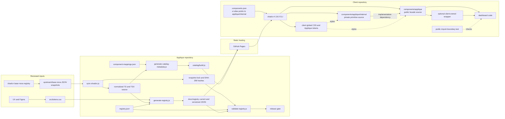
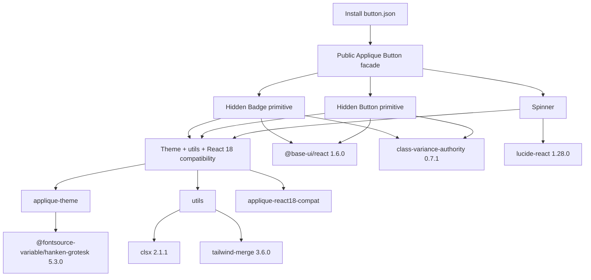
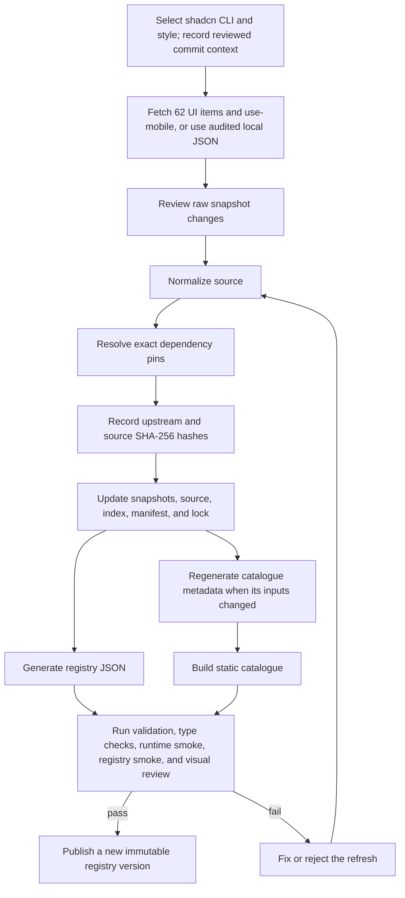
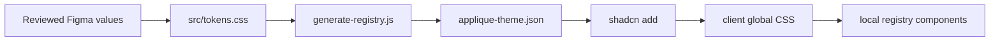
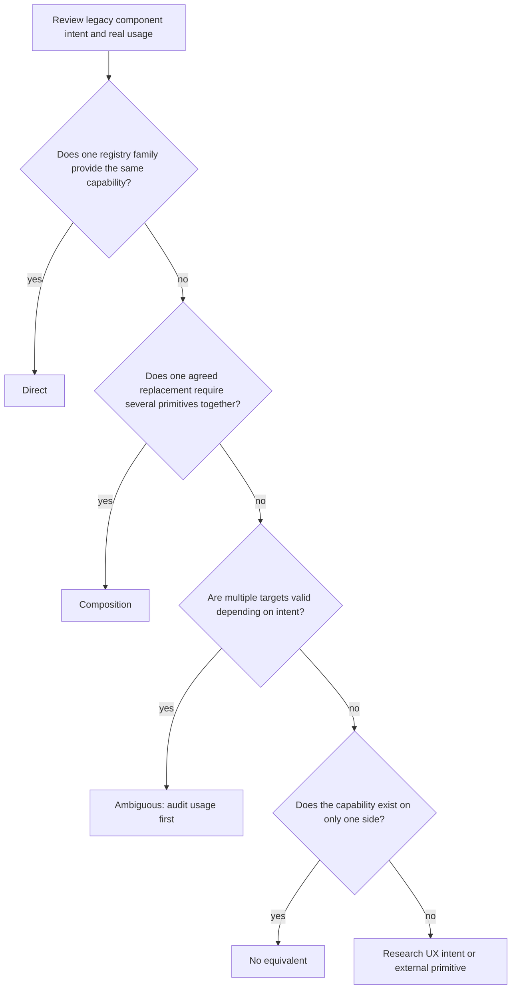
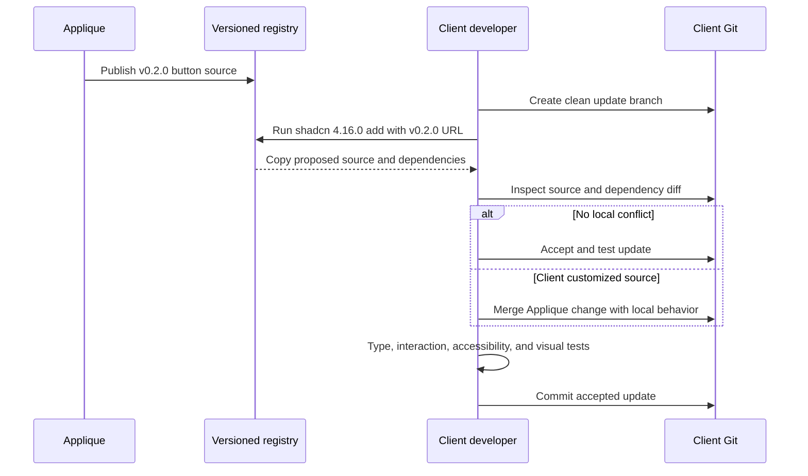
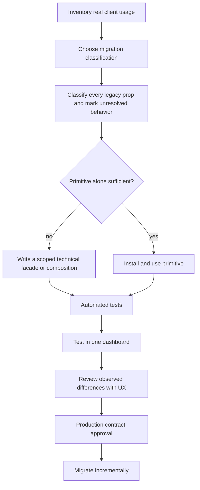

# Applique shadcn architecture, registry, and migration guide

This is the canonical document for the Applique shadcn initiative. It covers
the architectural decision, registry lifecycle, design-token delivery,
component migration model, prop strategy, client integration, maintenance,
testing, versioning, and manual GitHub Pages publishing.

For a presentation, start with the executive summary below and use the detailed
sections as supporting material or an appendix.

## Executive summary

The decision is to publish a **versioned shadcn source registry with Applique
tokens**. Clients install source code into their own repositories. Existing
Applique components migrate through selective, handwritten facades that keep
useful Applique props while forwarding non-conflicting shadcn and native props.

| Presentation question | Current answer |
| --------------------- | -------------- |
| Delivery model | Versioned source registry, not a runtime Applique npm package |
| Client experience | Run `shadcn add`, review copied source, then import local components |
| Client prerequisites | React 18, Tailwind CSS 4, and Node `>=20.18.1` for install/update |
| Current facade status | 18 installable adapters: seven technically ready and eleven explicitly testing |
| Production status | Installation and tests alone do not production-approve any facade |
| Existing screens | Existing `@applique-ui/*` imports remain unchanged until explicitly migrated |
| Next blockers | Animation CSS delivery, durable host, representative dashboard pilot, and resolution of known compatibility gaps |

### Component accounting

These counts answer three different questions and should not be added together
without considering their scope:

| Outcome | Count | Meaning | Included in the 72-entry public catalogue? |
| ------- | ----: | ------- | :----------------------------------------: |
| Applique components with implemented adapters | 18 | Seven technically ready facades plus eleven testing facades | Yes |
| Pinned shadcn primitive capabilities | 52 | Applique tokens are applied; these recipes support public components but are not a second application import API | Yes, for implementation discovery |
| Unavailable upstream entries | 2 | Form is fileless/deprecated; Message Scroller requires React 19 | Yes, for discovery only |
| Applique-only components retained in the existing library | 13 | No selected shadcn equivalent; they are not yet new registry items | No |

Therefore, the public catalogue calculation is:

```text
72 entries = 18 Applique facades + 52 pinned shadcn capabilities + 2 unavailable entries
```

The catalogue status summary is `59 ready + 11 testing + 2 unavailable`.
Here, 59 ready means 52 technically installable primitive recipes plus the
seven technically ready public facades; it does not make the private primitive
paths a supported application API.

The 13 retained Applique-only capabilities are:

> click-away, error-boundary, grid, icon, input-masked, layout, measure,
> portal, schema-form, stepper, text, virtual-grid, virtual-list.

Separately, migration metadata identifies 25 shadcn-only capabilities. Twenty-four
are installable in the React 18 baseline; Message Scroller is the unavailable
React 19 exception. These are a subset of the shadcn catalogue entries above,
not an additional 25 components.

In this document, **installable** or catalogue **ready** means the registry
source graph passes its technical gates. It does not by itself mean that a
facade is approved for production migration or that UX has accepted every
behavioral and visual difference.

## Contents

1. [Decision](#1-decision)
2. [Current release baseline](#2-current-release-baseline)
3. [Architecture](#3-architecture)
4. [Why registry plus facade](#4-why-registry-plus-facade)
5. [Registry contents and dependency graph](#5-registry-contents-and-dependency-graph)
6. [Upstream sync and registry generation](#6-upstream-sync-and-registry-generation)
7. [Tokens, typography, and theming](#7-tokens-typography-and-theming)
8. [Component migration classification](#8-component-migration-classification)
9. [Prop migration and facade design](#9-prop-migration-and-facade-design)
10. [Button facade example](#10-button-facade-example)
11. [Client requirements and installation](#11-client-requirements-and-installation)
12. [Client ownership, customization, and updates](#12-client-ownership-customization-and-updates)
13. [Adoption and migration plan](#13-adoption-and-migration-plan)
14. [Catalogue](#14-catalogue)
15. [Maintainer workflows](#15-maintainer-workflows)
16. [Validation and testing](#16-validation-and-testing)
17. [Manual GitHub Pages publishing](#17-manual-github-pages-publishing)
18. [Governance and UX decisions](#18-governance-and-ux-decisions)
19. [Risks and trade-offs](#19-risks-and-trade-offs)
20. [Troubleshooting](#20-troubleshooting)
21. [Pending action items and what to pick next](#21-pending-action-items-and-what-to-pick-next)
22. [Checklists](#22-checklists)
23. [Glossary](#23-glossary)

## 1. Decision

### Chosen approach

Use a **versioned shadcn source registry with Applique tokens**, and add
**Applique-owned facade components only where migration requires them**.

The architecture exposes one client-facing API namespace:

1. **Public Applique components: `@/components/applique/*`**
  - stable Applique-owned API for application code;
  - preserves reviewed Applique props and may forward non-conflicting native or
    shadcn extensions;
  - added component by component with explicit prop contracts and tests;
  - eighteen installable items exist: seven technically ready facades and eleven
    testing facades (Accordion, Basic InputText, Tabs, Tooltip, Button,
    ButtonGroup, Banner, Section, InputDate, InputSelect, and Field);
  - registry installation and passing tests do not by themselves mean that a
    facade is production- or UX-approved.
2. **Private implementation: `@/components/applique/internal/*`**
  - pinned shadcn Base/Nova source with Applique tokens;
  - copied recursively when a public item needs it;
  - configured through the shadcn `ui` alias for installation only;
  - never imported by application screens.

The registry can carry additional pinned raw recipes, but a new shadcn-only
capability is not a supported application API until Applique adds an explicit
public entry for it.

This preserves the main benefit of shadcn: clients own the installed source.
It also gives Applique a place to preserve intentional contracts without
forcing every primitive through a large centrally maintained package.

### What this architecture is

- A consistent, reviewed starting point for dashboard UI.
- A source-distribution system rather than a runtime component dependency.
- A pinned snapshot of shadcn, Base UI, npm dependencies, tokens, and fonts.
- An opt-in update model based on source diffs.
- A phased migration path that leaves existing Applique components untouched.

### What this architecture is not

- It is not an npm package that centrally controls every rendered component.
- It is not an automatic update mechanism.
- It is not a promise that all legacy props already work on registry
primitives.
- It is not a guarantee that local client modifications remain consistent with
Applique.
- It is not a way to swap shadcn for another library with zero client impact.
Applique-owned facade props can remain stable, but clients using primitive
APIs or implementation-specific extension props may need changes.

### Current implementation status


| Capability                     | Status             | Notes                                                   |
| ------------------------------ | ------------------ | ------------------------------------------------------- |
| Versioned shadcn registry      | Implemented        | Current release is `v0.1.0`                             |
| Applique light tokens and font | Implemented        | Installed through `applique-theme`                      |
| React 18 compatibility         | Implemented        | Separate Applique-owned compatibility helper            |
| TS/TSX and JS/JSX installation | Implemented        | Selected by the client's `components.json`              |
| Static component catalogue     | Implemented        | Component previews, API, install URLs, migration view   |
| Installable primitive maturity | Experimental       | 52 pinned primitive capabilities are experimental and private to the implementation boundary |
| Base/Nova animation delivery   | Known gap          | Registry clients do not yet receive all animation CSS   |
| Component relationship mapping | Partially implemented | 18 relationships have installable facades, but all 37 mapping records still await UX and production approval |
| Prop audit                     | Partially reviewed | Accordion `active`, InputText `className`, Tabs `type`/`isActive`, Tooltip click triggering, Button color/router policy, and remaining Banner.Actionable overlay/null-icon decisions are unresolved |
| Applique facade components     | 18 installable     | Seven technically ready; Accordion, Basic InputText, Tabs, Tooltip, Button, ButtonGroup, Banner, Section, InputDate, InputSelect, and Field are explicitly testing |
| Automatic legacy migration     | Not implemented    | Migration is explicit and component-by-component        |


## 2. Current release baseline


| Contract                   | Pinned value                                      |
| -------------------------- | ------------------------------------------------- |
| Registry release           | `v0.1.0`                                          |
| Workspace package version  | `@rohangore1999/shadcn-primitives@0.2.0`          |
| Distribution contract      | Registry URLs, not the workspace package version  |
| shadcn CLI                 | `4.16.0`                                          |
| shadcn style               | `base-nova`                                       |
| Recorded upstream commit   | `705ce5961080264830471ddd885c01b907706068`        |
| Installer/update Node.js   | `>=20.18.1`                                       |
| React peer range           | `^18.0.0`                                         |
| Tested React / React DOM   | `18.3.1`                                          |
| Tailwind CSS               | `4`, tested with `4.3.3`                          |
| Consumer source format     | TS/TSX with `tsx: true`; JS/JSX with `tsx: false` |
| Typography                 | `@fontsource-variable/hanken-grotesk@5.3.0`       |
| Official shadcn UI entries | 62                                                |
| Installable UI entries     | 60                                                |
| Support hooks              | 1                                                 |
| Registry foundations       | 3                                                 |
| Applique facade items      | 18                                                |
| Total registry items       | 84                                                |


The registry version and workspace package version are intentionally separate.
Clients install `v0.1.0` registry URLs; they do not depend on the workspace
package's `0.2.0` version.

Of the 60 installable pinned UI sources, 52 distinct shadcn capabilities are
marked `experimental` and eight same-named facade dependencies are marked
`internal`. Of the 18 facade items, seven are technically ready and Accordion,
Basic InputText, Tabs, Tooltip, Button, ButtonGroup, Banner, and Section are
testing, together with the Partner Portal-scoped InputDate and InputSelect
facades and the public Field facade. Field remains testing until the legacy
`info` behavior is resolved. These statuses mean the source graph passes the
registry gates; none of them alone means production or UX approval.

The current `rohangore1999.github.io` Pages domain is an evaluation host. An
organization-owned durable host and owner must be agreed before production
adoption because absolute host URLs are embedded in registry dependencies.

### UI coverage

The 60 installable pinned upstream source families are listed below. Their
registry recipe names remain available for dependency resolution and catalogue
discovery. When installed for an application, their files belong under
`@/components/applique/internal/*`, regardless of whether the recipe retains
its upstream name or uses an `applique-internal-*` collision-safe name:

> accordion, alert, alert-dialog, aspect-ratio, attachment, avatar, badge,
> breadcrumb, bubble, button, button-group, calendar, card, carousel, chart,
> checkbox, collapsible, combobox, command, context-menu, dialog, direction,
> drawer, dropdown-menu, empty, field, hover-card, input, input-group,
> input-otp, item, kbd, label, marker, menubar, message, native-select,
> navigation-menu, pagination, popover, progress, radio-group, resizable,
> scroll-area, select, separator, sheet, sidebar, skeleton, slider, sonner,
> spinner, switch, table, tabs, textarea, toast, toggle, toggle-group, tooltip.

Accordion, Avatar, Badge, Button, ButtonGroup, Tabs, Tooltip, and Field require
distinct public and raw implementations. Clients install the public Applique
entry; the CLI pulls the hidden raw source only as an implementation
dependency. The same public/private rule also applies to every other primitive.

Two official entries are retained for complete discovery but are not
installable:

- **Form** is fileless and deprecated in the pinned Base/Nova snapshot. Use the
public Applique Field facade.
- **Message Scroller** depends on an upstream `@shadcn/react` primitive that
requires React 19. It is excluded from the React 18 baseline.

Date Picker and Data Table are shadcn recipes/compositions, not official source
items in this registry index. The package-only
`packages/shadcn-primitives/src/data-table.tsx` is not part of registry
`v0.1.0`.

## 3. Architecture

### End-to-end architecture



The client owns both copied folders, but they have different contracts. Only
`components/applique/*` is imported by application code. The
`components/applique/internal/*` folder contains the private shadcn source that
the facades require and is selected by the client's `ui` alias.


### Layer responsibilities


| Layer              | Owns                                                                        | Does not own                   |
| ------------------ | --------------------------------------------------------------------------- | ------------------------------ |
| UX/Figma           | visual intent, tokens, states, interaction decisions                        | registry mechanics             |
| Upstream shadcn    | primitive starting source and API                                           | Applique compatibility         |
| Applique registry  | reviewed snapshot, transforms, tokens, dependency pins, versions, catalogue | client-local modifications     |
| Registry primitive | shadcn API plus Applique theme                                              | legacy Applique prop contract  |
| Applique facade    | stable mapped/composed Applique contract                                    | arbitrary application behavior |
| Client             | installed source, application composition, accepted updates, local testing  | shared registry release        |


### Source-of-truth and generated files


| Resource                              | Path                                                         | Edit directly?                   |
| ------------------------------------- | ------------------------------------------------------------ | -------------------------------- |
| Canonical architecture guide          | `docs/REGISTRY.md`                                           | Yes                              |
| Release manifest and dependency graph | `packages/shadcn-primitives/registry.json`                   | Yes, through reviewed changes    |
| Token source                          | `packages/shadcn-primitives/src/tokens.css`                  | Yes                              |
| Lock/manifest-listed component source | `packages/shadcn-primitives/src/<item>.tsx`                  | Normally generated by sync       |
| React 18 helper                       | `packages/shadcn-primitives/src/applique-react18-compat.ts`  | Yes, with tests                  |
| Shared `cn()` helper                  | `packages/shadcn-primitives/src/utils.ts`                    | Yes, with tests                  |
| Support hook                          | `packages/shadcn-primitives/src/use-mobile.ts`               | Normally generated by sync       |
| Raw upstream snapshots                | `packages/shadcn-primitives/upstream/base-nova/*.json`       | Only through intentional refresh |
| Version and content lock              | `packages/shadcn-primitives/shadcn-base-nova.lock.json`      | Generated by sync                |
| Migration metadata                    | `packages/shadcn-primitives/catalog/component-mappings.json` | Yes, curated                     |
| Catalogue generated metadata          | `packages/shadcn-primitives/catalog/generated/*`             | No                               |
| Public registry                       | `docs/registry/**`                                           | No                               |
| Public catalogue bundle               | `docs/catalog/**`                                            | No                               |


Generated registry JSON, generated catalogue metadata, bundled catalogue
assets, and the sync-generated `src/index.ts` must not be hand-edited.

## 4. Why registry plus facade

### Options evaluated


| Approach                                       | Advantages                                                                                                    | Disadvantages                                                                                                                                 | Decision                                     |
| ---------------------------------------------- | ------------------------------------------------------------------------------------------------------------- | --------------------------------------------------------------------------------------------------------------------------------------------- | -------------------------------------------- |
| Central npm package containing every component | One runtime version; central fixes; familiar package import                                                   | Requires a maintaining team; maps every prop centrally; clients have less source control; package upgrades are still opt-in; runtime coupling | Not the primary delivery model               |
| Raw upstream shadcn per client                 | Maximum client control; lowest central code                                                                   | No shared Applique tokens, pins, review, provenance, or migration guidance                                                                    | Insufficient for cross-dashboard consistency |
| Applique registry only                         | Shared reviewed baseline; source ownership; no runtime Applique package; reusable pinned shadcn primitives behind one public namespace | Clients can diverge; updates require diff/merge; public entries must be added deliberately                                                    | Implemented foundation                       |
| Applique registry plus selective facades       | Registry benefits plus stable Applique contracts where valuable; supports phased migration                    | Facades still need handwritten mapping, composition, tests, and ownership                                                                     | Recommended target                           |


### Why an npm package alone does not solve updates

A package change also requires every client to:

1. update the package version;
2. resolve dependency and API changes;
3. test the dashboard;
4. deploy the dashboard.

The package gives central runtime ownership, but it does not eliminate client
work. With no dedicated Applique maintenance team and a strong need for local
customization, forcing every component through a package would create a large
central bottleneck.

### Why source duplication is acceptable

Every client receives its own copy of a component. This is normal shadcn
behavior, not a build anti-pattern:

- a dashboard bundles its own installed component once;
- the registry itself is not shipped to the browser;
- unused registry items are not installed;
- normal bundler tree-shaking and code-splitting still apply.

The trade-off is operational, not primarily bundle size: multiple repositories
must review and accept later source updates. That trade-off is intentional
because it gives clients control.

### Consistency boundary

The registry guarantees a consistent **starting baseline** through:

- exact source snapshots;
- exact dependency pins;
- common semantic tokens;
- common typography;
- common primitive behavior;
- reviewed previews and validation.

It cannot guarantee permanent consistency after clients edit source or skip
updates. Teams that intentionally diverge own the future merge cost.

## 5. Registry contents and dependency graph

The manifest contains 84 items:

- 62 `registry:ui` entries;
- 18 `registry:component` facade items;
- 1 `registry:hook` entry;
- 2 `registry:lib` entries;
- 1 `registry:theme` entry.

### Foundation items


| Item                      | Target                            | Purpose                                                                        |
| ------------------------- | --------------------------------- | ------------------------------------------------------------------------------ |
| `applique-theme`          | Client's configured global CSS    | Applique variables, Tailwind mappings, scoped color-mode variants, font        |
| `utils`                   | `@lib/utils.ts`                   | Standard `cn()` helper using exact `clsx` and `tailwind-merge` pins            |
| `applique-react18-compat` | `@lib/applique-react18-compat.ts` | `withReact18Ref` and `mergeRefs` without taking ownership of client `utils.ts` |
| `use-mobile`              | `@hooks/use-mobile.ts`            | Support hook installed recursively by Sidebar                                  |


The validator calls the theme and two library items the three registry
foundations. The hook is counted separately.

The table shows canonical registry targets. When a client sets `"tsx": false`,
`shadcn@4.16.0` removes TypeScript syntax during installation and writes the
library and hook targets as `.js` and component targets as `.jsx`.

### Example: Button dependency graph




Registry dependencies are recursive. A complex item such as Sidebar also pulls
its component dependencies and `use-mobile` automatically. Clients do not
preinstall the registry's exact npm dependency set one package at a time; the
pinned CLI installs what each requested item declares.

### Exact declared registry dependency universe

Only declared dependencies reached by the selected component graph are
installed. Installing all supported components can introduce these exact pins:


| Dependency                                  | Used for                                                       |
| ------------------------------------------- | -------------------------------------------------------------- |
| `@base-ui/react@1.6.0`                      | Accessible primitives used by the Base/Nova component families |
| `@fontsource-variable/hanken-grotesk@5.3.0` | Applique typography                                            |
| `class-variance-authority@0.7.1`            | Typed visual variants                                          |
| `clsx@2.1.1`                                | Conditional class composition in `cn()`                        |
| `cmdk@1.1.1`                                | Command                                                        |
| `date-fns@4.4.0`                            | Calendar date utilities                                        |
| `embla-carousel-react@8.6.0`                | Carousel behavior                                              |
| `input-otp@1.4.2`                           | Input OTP behavior                                             |
| `lucide-react@1.28.0`                       | Icons used by registry primitives                              |
| `next-themes@0.4.6`                         | Sonner theme integration                                       |
| `react-day-picker@10.0.1`                   | Calendar primitive                                             |
| `react-is@18.3.1`                           | Chart child inspection on React 18                             |
| `react-resizable-panels@4.12.2`             | Resizable panels                                               |
| `recharts@3.8.0`                            | Charts                                                         |
| `sonner@2.0.7`                              | Sonner notifications                                           |
| `tailwind-merge@3.6.0`                      | Tailwind-aware class merging in `cn()`                         |


These are registry-item dependencies, not packages every client must add
manually. React, React DOM, a JSX-capable application build, Tailwind, and the
installer Node/CLI requirements remain client prerequisites rather than
transitive substitutes. TypeScript is optional for clients.

### Known animation-delivery gap

The declared set above is not yet the complete functional styling dependency
set. These 11 normalized components use Base/Nova entry/exit animation
utilities:

> alert-dialog, combobox, context-menu, dialog, dropdown-menu, hover-card,
> menubar, navigation-menu, popover, select, tooltip.

Those utilities normally come from `shadcn/tailwind.css` and
`tw-animate-css`. The package CSS entry and CSS build path import both, but the current
`applique-theme` registry item does not install or import them, and the registry
smoke test does not assert that those utilities are emitted. A copied component
can therefore compile while silently missing part of its motion styling.

Treat this as a release gap, not as a client customization task. Before
production adoption, deliver the required animation CSS through the registry
theme/dependency graph and add a smoke assertion for representative compiled
animation utilities.

### Why the compatibility helper is separate

Most shadcn clients already have `@/lib/utils.ts` or `@/lib/utils.js`. If
Applique placed React 18 helpers in that file, the CLI could skip the existing
client file and installed components would fail to import the helpers.

The registry therefore keeps:

- standard `cn()` in the normal client-owned `utils.ts` or `utils.js`;
- Applique-specific ref behavior in
`applique-react18-compat.ts` or `applique-react18-compat.js`.

The full smoke test exercises both output modes. It creates an existing
`utils.ts` or `utils.js`, declines the overwrite prompt, verifies the file
remains byte-for-byte unchanged, type-checks the TS/TSX installation, and
validates the JS/JSX installation without a TypeScript client dependency.

## 6. Upstream sync and registry generation

### Upstream refresh flow

Normal builds are offline. An upstream refresh is explicit because the public
shadcn item endpoint is mutable.




From `packages/shadcn-primitives`:

```sh
# Intentional network refresh
pnpm run sync:shadcn -- --allow-network

# Refresh from an already reviewed local set
pnpm run sync:shadcn -- --from /absolute/path/to/base-nova-items

# Compare without writing
pnpm run sync:shadcn -- --from /absolute/path/to/base-nova-items --check
```

### Normalization performed by sync

The sync process:

1. reads 62 official Base/Nova UI entries and `use-mobile`;
2. checks the expected upstream item types;
3. rewrites upstream-private aliases to local dependencies;
4. replaces documentation-only icon placeholders with pinned Lucide icons;
5. changes unscoped `dark:` utilities to `applique-dark:`;
6. adds React 18 ref wrappers to exported function components;
7. preserves Calendar's internal focus ref while merging a consumer ref;
8. forwards Chart content refs;
9. pins every external dependency exactly;
10. updates normalized source, `registry.json`, `src/index.ts`, and the lock;
11. records hashes for raw upstream JSON and normalized local source.

Form and Message Scroller follow the documented exception paths rather than
publishing unsafe or empty source.

The component endpoint used by network sync is mutable. The recorded Git
commit provides reviewed provenance context, but it does not address or
cryptographically verify that endpoint. Reproducibility comes from the
checked-in raw JSON plus its recorded SHA-256 hashes. Catalogue preview fetching
is separately commit-addressed.

### Registry generation

`generate-registry.js` reads:

- `registry.json`;
- normalized source files;
- `src/tokens.css`;
- the configured registry base URL and version.

It writes both:

```text
docs/registry/button.json
docs/registry/v0.1.0/button.json
```

The root file is the mutable current-release alias. The versioned file is the
reproducible client contract. Internal registry dependencies use absolute,
versioned URLs.

Low-level generator options include:

- `APPLIQUE_REGISTRY_BASE_URL`;
- `APPLIQUE_REGISTRY_VERSION`;
- `APPLIQUE_REGISTRY_OUTPUT_DIR`.

For a real release, change `registry.json.meta.version`; an environment-only
version override is not the complete release workflow and will not satisfy the
normal validator reconciliation by itself. An alternate output directory also
requires validating that directory explicitly. Always generate with the final
host URL because dependency URLs are embedded in the output.

### Version rule

The current `v0.1.0` may change only while it truly has no consumers. As soon
as the first client adopts it:

1. mark `v0.1.0` immutable;
2. never rewrite `docs/registry/v0.1.0`;
3. publish later changes under a new version such as `v0.2.0`;
4. move only the root current alias to the new release;
5. retain older version directories.

This immutability rule is currently procedural. The generator can rewrite the
active version directory, and the validator has no historical golden-hash
ledger. Until that protection exists, enforce immutability through Git review
and ownership checks.

## 7. Tokens, typography, and theming

### Token pipeline




`src/tokens.css` is the reviewed runtime source. It currently contains the
light theme's semantic colors, radii, typography, weights, spacing, shadows,
sidebar values, and chart values.

Example:

```css
:root {
  --primary: #5232d0;
  --primary-foreground: #ffffff;
  --radius-md: 8px;
}

@theme inline {
  --color-primary: var(--primary);
  --color-primary-foreground: var(--primary-foreground);
}
```

Complete color values must not be wrapped in the obsolete
`hsl(var(--token))` form.

### Typography

The theme:

- installs `@fontsource-variable/hanken-grotesk@5.3.0`;
- adds its CSS import;
- maps `--font-sans` to Hanken Grotesk with system fallbacks.

The font is therefore part of the reviewed registry graph, not an undocumented
assumption about the host dashboard.

### Light-only behavior

Applique does not yet have a reviewed dark token collection. Upstream dark
branches are scoped to:

```css
[data-applique-color-scheme='dark']
```

Both `dark` and `applique-dark` use that explicit scope. A dashboard's global
`.dark` class or OS preference cannot accidentally activate upstream dark
styles against the light-only token set.

Do not set `data-applique-color-scheme="dark"` until UX publishes and approves
a complete dark theme.

### Changing tokens

1. Confirm the value and semantics with UX/Figma.
2. Edit `packages/shadcn-primitives/src/tokens.css`.
3. Build registry and catalogue output.
4. Run registry validation and both smoke tests.
5. Review current and versioned JSON diffs.
6. Publish under the correct registry version.

Never edit token values directly inside `docs/registry/*.json`.

## 8. Component migration classification

These classifications describe **migration relationships**, not permanent
labels on a primitive. One registry component can participate in many
relationships.


| Classification    | Current count | Simple meaning                                                                                   | Example                                               |
| ----------------- | ------------- | ------------------------------------------------------------------------------------------------ | ----------------------------------------------------- |
| **Direct**        | 12            | One shadcn component family is the primary target. Prop adaptation or structural wrapping may still be needed. | InputText → Input                                     |
| **Composition**   | 17            | Multiple shadcn component families plus Applique-owned behavior are required.                    | InputDate → Calendar + Popover + Input + Button       |
| **No equivalent** | 38            | The capability exists only on one side.                                                          | VirtualList is Applique-only; Carousel is shadcn-only |
| **Ambiguous**     | 6             | Real usage must be checked before choosing the replacement.                                      | Dropdown → Select, DropdownMenu, or Popover           |


The catalogue tabs show 73 classified capabilities/display entries:
`12 + 17 + 38 + 6 = 73`. The source metadata contains 37 records because the
38 no-equivalent components are grouped into two directional records.

All 37 classifications remain proposal-level for UX and production approval.
Implementing an installable technical facade does not by itself change that
governance status.

### Classification decision




### Direct mappings


| Applique      | Registry family | Current facade scope |
| ------------- | --------------- | -------------------- |
| Accordion     | Accordion       | Installable for testing; `active` compatibility remains explicit |
| Avatar        | Avatar          | Technically ready adapted facade |
| Badge         | Badge           | Technically ready adapted facade |
| BreadCrumb    | Breadcrumb      | Technically ready adapted facade |
| InputCheckbox | Checkbox        | Technically ready adapted facade |
| InputNumber   | Input           | Technically ready adapted facade |
| InputRadio    | RadioGroup      | Technically ready adapted facade |
| InputText     | Input           | Installable for testing; `className` target and full compatibility remain deferred |
| InputTextArea | Textarea        | Technically ready adapted facade |
| Tabs          | Tabs            | Installable for testing only; legacy `type` and child `isActive` behavior remains unresolved |
| Tooltip       | Tooltip         | Installable for testing only; legacy `triggerOn="click"` behavior remains unresolved |
| Section       | Card            | Installable for testing; explicit `actions` avoids React internals, but the Button dependency remains testing |


Direct does not mean identical props. For example, InputText's legacy
`onChange(value)` must adapt the registry Input's DOM event.

Installable also does not mean migration-approved. All eleven testing facades
are deliberately available so their unresolved behavior can be exercised in a
real dashboard, but production screens should not migrate to them until those
active legacy contracts are either preserved or intentionally changed.

Section is classified Direct because Card is its primary shadcn family. Direct
Applique Button children can still be promoted to its header, while lazy,
memoized, wrapped, and application-owned controls use the explicit `actions`
slot. Section no longer inspects private React lazy fields. Its facade remains
testing because the Button dependency is not yet production-approved.

```tsx
const LazyOrderAction = React.lazy(() => import('./order-action'))

<Section title="Orders" actions={<LazyOrderAction />}>
  <OrdersTable />
</Section>
```

### Composition mappings


| Applique    | Registry primitives and owned behavior         |
| ----------- | ---------------------------------------------- |
| Banner      | Alert + Button + Dialog                        |
| Button      | Button + Spinner + Badge                       |
| ButtonGroup | ButtonGroup + Button + DropdownMenu            |
| FAB         | Button + Popover                               |
| Field       | Field + Label                                  |
| Form        | Field + Input + Select + Checkbox + RadioGroup + Textarea + Button + ButtonGroup |
| Image       | AspectRatio + Skeleton around a native image   |
| Input       | Input + InputGroup                             |
| InputDate   | Calendar + Popover + Input + Button            |
| InputFile   | Input + Button + Attachment                    |
| InputMonth  | Popover + Input + Button                       |
| NavBar      | Sidebar + Sheet + NavigationMenu               |
| Page        | Sidebar + Breadcrumb + NavigationMenu          |
| Pagination  | Pagination + Select + Input                    |
| Table       | Table + DropdownMenu                           |
| TopBar      | Breadcrumb + Avatar + DropdownMenu             |
| TopNav      | NavigationMenu + Sheet + Sidebar               |


Composition means the facade renders several primitives and owns their
coordination, state, accessibility, formatting, or router integration.

Button and ButtonGroup are now published together as testing registry items.
ButtonGroup depends on the Applique Button item, so its cloned legacy visual
`type` never leaks into the native HTML `type` of the raw shadcn Button. Neither
is migration-ready until Button's remaining color semantics and shared router
policy are resolved and tested in a client. The current Button is nevertheless
safe to exercise: `to` uses a supplied RouterLink when available, otherwise a
string or pathname-like destination becomes a normal anchor. An unresolvable
object destination remains a button, and `to` keeps legacy precedence when
`href` is also present; none of these cases throws during render.

Banner is also published for focused testing. Its regular behavior is mapped,
and Actionable now deliberately preserves the active legacy rule that every
truthy `data.color` renders as `info`. Remaining decisions concern null-icon
compatibility and the full-screen Alert-versus-Dialog accessibility model.

### Ambiguous mappings


| Applique    | Candidate targets                      | Selection rule                                         |
| ----------- | -------------------------------------- | ------------------------------------------------------ |
| Dropdown    | Select / DropdownMenu / Popover        | stored value / actions / arbitrary interactive content |
| InputSelect | Select / Combobox / NativeSelect       | simple / searchable or multiple / native               |
| List        | Item / Command / Checkbox / RadioGroup | display / command / multi-select / single-select       |
| Loader      | Spinner / Progress                     | indeterminate / measurable                             |
| Modal       | Dialog / AlertDialog / Drawer / Sheet  | general / confirmation / mobile-bottom / side-panel    |
| Progress    | Progress / Spinner                     | bar or known value / circular or indeterminate         |


An ambiguous facade must not be selected by component name alone. Audit actual
usage, accessibility semantics, controlled state, content shape, and
responsive behavior first.

### No equivalent

Applique-only capabilities:

> click-away, error-boundary, grid, icon, input-masked, layout, measure,
> portal, schema-form, stepper, text, virtual-grid, virtual-list.

Keep these Applique-owned until a reviewed custom registry implementation or
external primitive is selected.

Currently identified shadcn-only capabilities:

> aspect-ratio, bubble, carousel, chart, command, context-menu, direction,
> empty, hover-card, input-otp, kbd, marker, menubar, message,
> message-scroller, resizable, scroll-area, separator, skeleton, slider,
> sonner, switch, toast, toggle, toggle-group.

A shadcn-only recipe may exist in the registry without a legacy migration
facade, but it remains an internal implementation capability. Application code
must not import it from `@/components/applique/internal/*`. To make that
capability client-facing, add an explicit public item under
`@/components/applique/*`, even when that public entry initially forwards the
reviewed primitive API. Message Scroller is the exception: it is discoverable
but not installable in the React 18 baseline.

Current mapping metadata has one known coverage follow-up: Collapsible exists
in the registry but is not yet classified, while the deprecated Form registry
entry is handled separately. Do not interpret the migration view as approval
or complete compatibility.

## 9. Prop migration and facade design

### The two catalogue references serve different audiences

The catalogue exposes two different kinds of information:

1. **Internal primitive API**
  - generated from checked-in TypeScript source;
  - helps Applique maintainers understand what the private shadcn primitive
    accepts;
  - is not a supported application import path.
2. **Migration prop audit**
  - curated in `component-mappings.json`;
  - tells teams how a legacy Applique contract moves through the public
    Applique component.

They answer different questions. A shared prop name does not prove shared
behavior.

### Prop audit categories


| JSON kind           | Catalogue label      | Meaning                                                      |
| ------------------- | -------------------- | ------------------------------------------------------------ |
| `forwarded`         | Direct / forwarded   | Same name and behavior; pass through unchanged               |
| `mapped`            | Mapped by facade     | Rename the prop or convert values/events                     |
| `composition-owned` | Owned by composition | Consume the prop and build behavior from multiple primitives |
| `unsupported`       | Unsupported          | Deliberately exclude it from the new facade                  |
| `needs-review`      | Needs review         | Usage or UX intent is unresolved                             |


Current audit coverage:

- 35 audited relationships covering all Direct, Composition, and Ambiguous
  records;
- 374 mapping rules assessing 404 source-prop occurrences (200 distinct names);
- 43 forwarded;
- 57 mapped;
- 207 composition-owned;
- 4 unsupported;
- 63 needing review.

### Mapping-driven structural contract gate

`pnpm run validate:facade-contracts` connects the audit data to the checked-in
registry and facade source. It fails when:

- a registered facade has no component mapping or prop contract;
- a documented legacy prop is absent from that contract;
- a resolved mapped prop is absent from its matching TypeScript-derived
  callable facade export;
- a non-testing facade still contains `needs-review`; or
- registry `unresolvedProps` no longer correspond to local or direct-facade
  mapping blockers.

This is an honest **structural** gate. It proves that the declared artifacts
agree; it cannot prove that the runtime implementation applies precedence in
the correct order, composes callbacks correctly, targets the correct DOM node,
or preserves absent/default values. Focused component specs remain mandatory
for those behaviors. `validate:registry` runs this structural gate as part of
the normal registry validation command.

### Compatibility hardening from implementation review

| Reviewed risk | Implemented result |
| ------------- | ------------------ |
| String icons depended on a hidden Applique SVG sprite | Button, Badge, Banner, and InputTextArea map known names to bundled Lucide SVGs; unknown names warn in development and render a visible fallback |
| Banner.Actionable changed the active legacy color result | Every truthy `data.color` again resolves to `info`, preserving the verified legacy runtime |
| Contract data was not connected to a release gate | `validate:facade-contracts` now checks structural mapping, source API, status, and blocker consistency; runtime meaning remains in specs |
| Plain empty Button invented a Bell | Plain `<Button />` stays visually empty with a neutral accessible name; Bell is limited to notifications and the legacy empty `xs` fallback |
| Button and Banner validation could throw during render | Button uses safe `to`/`href` and `xs` fallbacks; Banner omits incomplete links and marks them for diagnostics |
| Banner discarded a caller-supplied ARIA role | Both regular and Actionable Banner forward `role`, with `alert` only as the default |
| Section inspected private React lazy fields | Direct Applique Buttons are promoted by public component identity; all lazy, wrapped, or app-owned actions use the explicit `actions` slot |

The two grouped No-equivalent records do not have adapter prop contracts. A
**Prop audit pending** message elsewhere means the contract has not been
audited; it does not mean the component has no props or that all props are
compatible.

### Same name can still require mapping

`InputText.value → Input.value` is mapped, not directly forwarded, because the
legacy controlled component normalizes missing or non-string values to an
empty string.

`InputText.onChange → Input.onChange` is mapped because:

```text
registry Input: onChange(event)
legacy Applique: onChange(value)
```

Names match; contracts do not.

### Recommended facade type pattern

Expose:

1. stable Applique-owned props;
2. non-conflicting registry primitive props as an extension surface;
3. explicit mappings for collisions;
4. composition-owned behavior where a primitive is insufficient.

Conceptually:

```ts
type PrimitiveProps = React.ComponentProps<typeof RegistryComponent>

type AppliqueProps = Omit<PrimitiveProps, ConflictingPrimitiveProps> &
  AppliqueOwnedProps
```

This allows clients to use useful primitive features without mapping every
single shadcn prop. However, the two surfaces have different guarantees:


| Surface                         | Compatibility promise                                                             |
| ------------------------------- | --------------------------------------------------------------------------------- |
| Applique-owned props            | Stable facade contract; adapter must preserve or deliberately version it          |
| Non-conflicting primitive props | Implementation extension; may require migration if the underlying library changes |
| Direct primitive imports        | shadcn contract; not insulated by the facade                                      |


### Prop precedence rule

Primitive extension props are spread first. Applique-controlled values come
after the spread:

```tsx
<RegistryButton
  {...primitiveProps}
  variant={mappedVariant}
  size={mappedSize}
  disabled={disabled || loading}
/>
```

This prevents a conflicting extension prop from bypassing an Applique
invariant.

### Why not blindly spread a future library's props

If Applique later replaces shadcn, it can map the stable Applique-owned props
inside the facade. It must not assume another library's props have equivalent
meaning merely because their names match.

Clients using shadcn-specific extension props accept a smaller migration cost.
That is still better than hiding all primitive capabilities, but it must be an
explicit contract boundary.

### Facade acceptance rules

A facade should not be marked approved until:

- every owned prop is forwarded, mapped, composition-owned, unsupported, or
deliberately deprecated;
- all `needs-review` entries are resolved;
- defaults and value conversions are specified;
- event payloads are specified;
- accessibility and keyboard behavior are tested;
- responsive and router behavior are tested where relevant;
- UX approves visual equivalence or intentional change;
- real client usage has been sampled.

Automatic full prop mapping for every component is not safe. Direct mapping is
highly feasible; composition is feasible with handwritten code and tests;
ambiguous contracts require usage review.

## 10. Button facade example

### Why Button is composition

The hidden pinned shadcn Button primitive provides the basic interaction and
variants used inside the public Applique Button facade.
Legacy Applique Button also owns:

- loading UI and click suppression;
- notification count;
- named leading and trailing icons;
- large captioned layout;
- anchor and router rendering;
- legacy defaults and transforms.

Those behaviors must be rebuilt around Button, Spinner, and Badge.

### Implemented technical Button prop audit


| Legacy prop        | Strategy                 | Registry target or behavior                     |
| ------------------ | ------------------------ | ----------------------------------------------- |
| `children`         | Forwarded                | `Button.children`                               |
| `onClick`          | Forwarded with guard     | `Button.onClick`; loading/disabled still blocks |
| `disabled`         | Forwarded with invariant | `Button.disabled`; loading also forces disabled |
| `className`        | Forwarded                | Merge with registry classes                     |
| visual `type`      | Mapped                   | `Button.variant`                                |
| `htmlType`         | Mapped                   | native `Button.type`                            |
| `size`             | Mapped                   | registry size or owned large recipe             |
| `transform`        | Mapped                   | `style.textTransform`                           |
| `inheritTextColor` | Mapped                   | owned compatibility class                       |
| `icon`             | Composition-owned        | resolve icon and render before label            |
| `secondaryIcon`    | Composition-owned        | render after label                              |
| `loading`          | Composition-owned        | Spinner, disabled, click guard, `aria-busy`     |
| `notifications`    | Composition-owned        | bell/count Badge and `99+` behavior             |
| `href`             | Composition-owned        | polymorphic anchor rendering                    |
| `to`               | Needs review with safe fallback | use supplied RouterLink; otherwise anchor when a URL can be derived, or retain button semantics |
| `caption`          | Composition-owned        | secondary text in large recipe                  |
| runtime `label`    | Composition-owned        | fallback when children is absent                |
| `color`            | Needs review             | UX must define semantic tones                   |
| runtime `state`    | Unsupported              | remove arbitrary-state CSS escape hatch         |


Implemented visual value mapping:


| Legacy `type` | Registry `variant`                            |
| ------------- | --------------------------------------------- |
| `primary`     | `default`                                     |
| `secondary`   | `outline`                                     |
| `tertiary`    | `ghost`                                       |
| `link`        | `link` plus a reviewed compatibility modifier |
| `text`        | `link` plus a reviewed compatibility modifier |


The omitted legacy type must map to `outline` because the old default is
`secondary`. UX must approve the visual equivalence.

Implemented size mapping:


| Legacy `size` | Registry behavior                          |
| ------------- | ------------------------------------------ |
| `xs`          | `icon-xs` for icon-only use; safe `xs` button when labelled |
| `small`       | `sm`                                       |
| `regular`     | `default`                                  |
| `large`       | Applique-owned full-width captioned recipe |


### Current test-only implementation

Registry `v0.1.0` now ships `button.json`. The facade implements the
mapping above with Button, Spinner, and Badge, and keeps the raw primitive
details behind the public client path:

```tsx
import { Button } from '@/components/applique/button'

<Button type="primary" loading autoFocus aria-label="Save changes">
  Save
</Button>
```

Here `type` and `loading` are Applique-owned. The facade maps the visual type,
composes the Spinner, forces disabled and `aria-busy` while loading, and
forwards non-conflicting native props such as `autoFocus` and `aria-label`.
An explicit Applique `type` wins over a conflicting shadcn `variant`.

The technical facade also covers legacy size handling, leading and trailing
icons, the large caption layout, notifications with a `99+` cap, transforms,
inherited text color, `href` anchors, refs, and shadcn/native extensions.

String icon names are self-contained. Known legacy names, including the
documented InputTextArea `SpinnerSolid` example, are mapped to bundled Lucide
SVG components; an unknown name renders a visible fallback and warns in
development. Button, Badge, Banner, and InputTextArea therefore do not rely on
a page-level `<symbol id="uikit-i-*">` sprite. React elements and component
icons remain supported.

A plain empty `<Button />` no longer invents a Bell; it receives the neutral
accessible name `Button` and a diagnostic data attribute. The Bell fallback is
limited to notification buttons and the legacy empty `size="xs"` path. Invalid
link combinations and `xs` combinations are handled without render-time
exceptions and expose diagnostic `data-applique-*` attributes for tests.

It remains **test-only** because:

- arbitrary legacy `color` values are recorded for auditing but do not yet
  change the visual recipe;
- a supplied `render={<RouterLink />}` remains the preferred client-router
  integration; without it, string and pathname-like `to` values safely use
  browser navigation, while unresolvable objects remain buttons;
- the undocumented 100 ms click cooldown, static `Button.Link` and
  `Button.RouterLink` members, and class-instance refs are not reproduced;
- runtime `state` is deliberately unsupported, and callers must provide an
  accessible label for non-notification icon-only buttons.

These gaps must be accepted, mapped, or explicitly removed before production
migration approval. The focused facade suite covers the mapped behavior and
safe fallbacks, and the registry smoke installs the same source in both TSX and
JSX clients.

### Import path during phased migration

Existing import forms remain unchanged until a screen is intentionally migrated:

```tsx
import { Button } from '@applique-ui/uikit'
import Button from '@applique-ui/button'
```

The installable facades use one public client namespace:

```tsx
import { Avatar } from '@/components/applique/avatar'
import { Badge } from '@/components/applique/badge'
import { BreadCrumb } from '@/components/applique/bread-crumb'
import { InputCheckbox } from '@/components/applique/input-checkbox'
import { InputNumber } from '@/components/applique/input-number'
import { InputRadio } from '@/components/applique/input-radio'
import { InputTextArea } from '@/components/applique/input-text-area'

// Test-only until active legacy behavior is resolved.
import { Accordion, AccordionItem } from '@/components/applique/accordion'
import { InputText } from '@/components/applique/input-text'
import { Button } from '@/components/applique/button'
import { ButtonGroup } from '@/components/applique/button-group'
import { Banner } from '@/components/applique/banner'
import { Section } from '@/components/applique/section'
import { Tabs, Tab } from '@/components/applique/tabs'
import { Tooltip } from '@/components/applique/tooltip'
```

Raw shadcn primitive paths are implementation details of the facade, not a
second public Applique API. Installing a facade does not rewrite any existing
screen, so migration remains explicit and component by component.

## 11. Client requirements and installation

### Hard requirements


| Requirement                                    | Where needed                                    | Why                                                                          |
| ---------------------------------------------- | ----------------------------------------------- | ---------------------------------------------------------------------------- |
| Node.js `>=20.18.1`                            | Install/update command and registry maintenance | Required by the pinned CLI/tooling                                           |
| `shadcn@4.16.0`                                | Install/update command                          | Reproducible registry interpretation                                         |
| React and React DOM 18                         | Application                                     | Registry source baseline; tested at `18.3.1`                                 |
| Tailwind CSS 4                                 | Application build/styling                       | Copied source uses Tailwind utilities and the theme uses Tailwind 4 features |
| JavaScript/JSX or TypeScript/TSX build         | Application build                               | Runs the source format selected by `components.json`                         |
| Compatible `components.json`                   | Install/update command                          | Selects `base-nova`, output mode, CSS, and valid aliases                     |
| Matching `jsconfig`/`tsconfig` and aliases     | Application build                               | Resolves generated local imports in editor tooling and the bundler           |
| Loaded global CSS with `@import 'tailwindcss'` | Application                                     | Receives and compiles the installed theme                                    |
| Network access to registry and npm metadata    | Install/update command                          | Fetches JSON and exact dependencies                                          |


Node 20 is an installation-tool requirement. The copied component source adds
no Node 20 runtime requirement. A client can keep Node 18 for its normal
development/build workflow only if its own framework and dependencies support
it.

TypeScript is not a client prerequisite. Applique keeps one canonical registry
source in TS/TSX. With `"tsx": false`, `shadcn@4.16.0` removes TypeScript syntax
and writes `.js`/`.jsx` files during installation. The client still needs its
normal JSX-capable application build.

Tailwind is not an Applique npm runtime dependency, but Tailwind 4 **is a hard
consumer styling/build prerequisite** for the current source registry. A
non-Tailwind client needs a separately designed compiled-CSS distribution.

Tailwind 4 plus `@import 'tailwindcss'` is not yet sufficient for all motion
styles; see the known animation-delivery gap in section 5.

The exact alias paths and CSS filename remain client-owned; only the compatible
configuration characteristics are required.

### What clients do not need

- no runtime import from `@rohangore1999/shadcn-primitives`;
- no Applique registry npm package;
- no separate token package;
- no separate Tailwind preset;
- no TypeScript dependency or compiler when the application uses JavaScript;
- no requirement to copy Applique's sample `components.json` paths;
- no manual installation of every transitive dependency.

### Client-owned `components.json`

Applique does not own the client's config. The CLI reads it to determine where
to copy files and which global CSS file to update.

A recommended configuration keeps the public and private boundaries next to
each other. `components` is the root for public Applique files, while the
shadcn `ui` alias is deliberately routed to the private implementation folder:

```json
{
  "$schema": "https://ui.shadcn.com/schema.json",
  "style": "base-nova",
  "rsc": false,
  "tsx": true,
  "tailwind": {
    "config": "",
    "css": "src/index.css",
    "baseColor": "neutral",
    "cssVariables": true,
    "prefix": ""
  },
  "iconLibrary": "lucide",
  "aliases": {
    "components": "@/components",
    "ui": "@/components/applique/internal",
    "utils": "@/lib/utils",
    "lib": "@/lib",
    "hooks": "@/hooks"
  }
}
```

Set `"tsx": true` for `.ts`/`.tsx` output. Set `"tsx": false` for
`.js`/`.jsx` output. This choice belongs to the client; it does not require a
different Applique registry or URL.

The source root may differ, but the logical boundary is part of the client
contract: application code imports only `@/components/applique/*`, and raw
primitive dependencies resolve only under
`@/components/applique/internal/*`. The aliases must also resolve in the
client's `jsconfig.json` or `tsconfig.json` and in the bundler, for example:

```json
{
  "compilerOptions": {
    "baseUrl": ".",
    "paths": {
      "@/*": ["./src/*"]
    }
  }
}
```

The `ui` alias is an installer mechanism, not a second application API. Teams
must not import from it directly. This keeps raw Button, Field, Calendar,
Popover, Spinner, and other shadcn building blocks replaceable behind the
public Applique components.

The configured CSS entry must be loaded by the application and contain:

```css
@import 'tailwindcss';
```

### Install the seven technically ready adapted facades

Use the pinned CLI and versioned registry URLs on a client branch:

```sh
npx shadcn@4.16.0 add \
  https://rohangore1999.github.io/applique-ui/registry/v0.1.0/input-number.json \
  https://rohangore1999.github.io/applique-ui/registry/v0.1.0/avatar.json \
  https://rohangore1999.github.io/applique-ui/registry/v0.1.0/badge.json \
  https://rohangore1999.github.io/applique-ui/registry/v0.1.0/bread-crumb.json \
  https://rohangore1999.github.io/applique-ui/registry/v0.1.0/input-text-area.json \
  https://rohangore1999.github.io/applique-ui/registry/v0.1.0/input-radio.json \
  https://rohangore1999.github.io/applique-ui/registry/v0.1.0/input-checkbox.json
```

The CLI copies public files to `@/components/applique` and all raw shadcn
dependencies to `@/components/applique/internal` through the configured `ui`
alias. Same-named components therefore remain unambiguous: the application uses
the public file, while the facade imports its private primitive.
It also installs exact npm dependencies and updates the configured global CSS
with Applique tokens. Existing legacy imports are unaffected.

### Install the eleven testing facades

Accordion, Basic InputText, Tabs, Tooltip, Button, ButtonGroup, Banner, and
Section are registry-installable so teams can evaluate the remaining
compatibility gaps. InputDate and InputSelect are also installable with a
deliberately scoped Partner Portal filter contract. Field provides the public
namespace over the private raw Field while its legacy `info` behavior remains
unresolved:

```sh
npx shadcn@4.16.0 add \
  https://rohangore1999.github.io/applique-ui/registry/v0.1.0/accordion.json \
  https://rohangore1999.github.io/applique-ui/registry/v0.1.0/input-text.json \
  https://rohangore1999.github.io/applique-ui/registry/v0.1.0/button.json \
  https://rohangore1999.github.io/applique-ui/registry/v0.1.0/button-group.json \
  https://rohangore1999.github.io/applique-ui/registry/v0.1.0/banner.json \
  https://rohangore1999.github.io/applique-ui/registry/v0.1.0/section.json \
  https://rohangore1999.github.io/applique-ui/registry/v0.1.0/input-date.json \
  https://rohangore1999.github.io/applique-ui/registry/v0.1.0/input-select.json \
  https://rohangore1999.github.io/applique-ui/registry/v0.1.0/field.json \
  https://rohangore1999.github.io/applique-ui/registry/v0.1.0/tabs.json \
  https://rohangore1999.github.io/applique-ui/registry/v0.1.0/tooltip.json
```

Do not treat this command as production migration approval:

- Accordion accepts `active`, but the verified legacy runtime did not apply it;
  that compatibility decision remains explicit rather than silently hidden.
- Basic InputText still needs approval for whether `className` targets the
  legacy wrapper or the registry input element.
- Tabs currently accepts legacy `type` and child `isActive` props without
  reproducing their active legacy visual/state behavior.
- Tooltip currently accepts `triggerOn`, but click-triggered behavior is not
  reproduced.
- Button does not yet map arbitrary `color`; a client-supplied RouterLink is
  preferred for `to`, while the safe fallback prevents render-time crashes.
- ButtonGroup preserves grouping and overflow behavior but inherits Button's
  unresolved color and router contract.
- InputDate covers controlled single dates, complete ranges, formatting,
  labels, descriptions, errors, and clearing. Disabled-date rules, presets,
  month/year selection, time selection, and native `FormData` serialization
  remain outside this pilot; clients use the controlled `value`/`onChange`
  contract.
- InputSelect covers primitive label/value options, single and multiple
  values, text/number labels, search, loading, errors, and clearing. Rich option rendering, custom
  filtering, adornments, and direction variants remain outside this pilot.
- Field provides the public Field, FieldLabel, FieldDescription, FieldError,
  FieldGroup, FieldLegend, FieldSeparator, FieldSet, FieldTitle, and
  FieldContent exports. Its legacy `info` compatibility remains under review.
- Banner forwards an explicit `role`, defaults it to `alert`, and omits partial
  links without throwing. Actionable preserves the legacy truthy-color-to-info
  behavior; null-icon and Alert-versus-Dialog decisions remain pending.
- Section uses an explicit `actions` slot for lazy, memoized, wrapped, or
  application-owned header actions. Direct Applique Button children are still
  promoted, without reading undocumented React internals. Section continues to
  inherit the testing Button dependency.

Use these items only for focused dashboard testing until the compatibility
contract is resolved and covered by the production acceptance gates.

### One public name per migrated component

Clients install the public Button directly:

```sh
npx shadcn@4.16.0 add \
  https://rohangore1999.github.io/applique-ui/registry/v0.1.0/button.json
```

`button.json` is the Applique-compatible public facade. It accepts the legacy
Applique contract plus reviewed, non-conflicting shadcn and native extensions.
There is no separate client-facing `applique-button.json` or raw Button page.

The registry still installs the pinned raw shadcn Button because the facade and
other shadcn components need it. That source is an implementation detail at:

```text
src/components/applique/internal/button.tsx
```

With `"tsx": true`, the public and internal result is typically:

```text
src/components/applique/button.tsx
src/components/applique/internal/badge.tsx
src/components/applique/internal/button.tsx
src/components/applique/internal/spinner.tsx
src/lib/applique-react18-compat.ts
src/lib/utils.ts
src/index.css
```

With `"tsx": false`, the TypeScript source files become JavaScript/JSX files.
Application code imports only the public facade:

```tsx
import { Button } from '@/components/applique/button'
```

If `src/lib/utils.ts` or `src/lib/utils.js` already exists with the normal
`cn()` export, keep it. The Applique compatibility helper is installed
separately.

The same public Button also exposes reviewed, non-conflicting shadcn
extensions. Clients still use the public facade path:

```tsx
import { Button } from '@/components/applique/button'

export function Actions() {
  return (
    <div className="flex gap-2">
      <Button type="primary">Save</Button>
      <Button variant="destructive">Delete</Button>
    </div>
  )
}
```

When no Applique `type` is provided, the facade exposes the pinned shadcn
variants:
`default`, `secondary`, `outline`, `ghost`, `destructive`, and `link`.

It also accepts the supported shadcn size extensions alongside the Applique
size vocabulary:
`xs`, `sm`, `default`, `lg`, `icon`, `icon-xs`, `icon-sm`, and `icon-lg`.

### Install multiple components

This example installs two public Applique components. Their private shadcn
dependencies are pulled automatically, so clients do not install or import
those dependencies separately:

```sh
npx shadcn@4.16.0 add \
  https://rohangore1999.github.io/applique-ui/registry/v0.1.0/button.json \
  https://rohangore1999.github.io/applique-ui/registry/v0.1.0/input-checkbox.json
```

### Add a new shadcn-only capability

A pinned raw recipe can be added to the registry for reuse, but it is not a
client API by itself. For example, the presence of `carousel.json` does not
authorize application code to import the installed internal Carousel.

Before a client consumes a new capability, Applique adds a reviewed public
entry under `@/components/applique/*`. That entry may be a thin forwarder when
no compatibility mapping is needed, but it still defines the supported import
path and keeps the raw primitive private.

### Form and Message Scroller

Use the public Field facade instead of the fileless Form item:

```sh
npx shadcn@4.16.0 add \
  https://rohangore1999.github.io/applique-ui/registry/v0.1.0/field.json
```

Application code imports Field only from the public namespace:

```tsx
import { Field, FieldLabel } from '@/components/applique/field'
```

The public Field facade uses the pinned raw Field implementation installed at
`@/components/applique/internal/field`; application code must not import that
file directly.

Message Scroller has no install command in the React 18 baseline.

### Current alias versus versioned URL

This mutable URL is useful for exploration:

```text
https://rohangore1999.github.io/applique-ui/registry/button.json
```

During evaluation, prefer the versioned path:

```text
https://rohangore1999.github.io/applique-ui/registry/v0.1.0/button.json
```

Before production adoption, replace the personal domain with the approved
durable organization host, regenerate the release so all embedded dependencies
use it, and then keep that versioned URL available permanently.

### Managed office TLS

If the CLI reports `self-signed certificate in certificate chain`, Node does
not trust the corporate proxy CA used while reaching public metadata.

Use the approved platform PEM:

```sh
NODE_EXTRA_CA_CERTS=/approved/path/corporate-ca.pem \
  npx shadcn@4.16.0 add \
  https://rohangore1999.github.io/applique-ui/registry/v0.1.0/button.json
```

Never disable TLS verification.

## 12. Client ownership, customization, and updates

### Ownership after installation

Files copied into the client repository belong to that client. The team may:

- inspect them;
- compose them;
- add application-specific variants;
- make reviewed local changes;
- keep a pre-existing compatible `utils.ts` or `utils.js`.

Local modifications create an intentional fork. The client owns future merge
work and consistency risk.

### Update flow




An installed component does not change merely because Applique publishes a
new registry version.

Recommended client procedure:

1. Start from a clean branch.
2. Choose the target immutable registry version.
3. Run `shadcn add` for the item.
4. If prompted about an existing file, overwrite only on the isolated branch
  when deliberately producing the proposed diff.
5. Review source, CSS, and dependency changes.
6. Merge local customizations.
7. Run client tests and visual checks.
8. Commit the accepted source.

Example future update:

```sh
npx shadcn@4.16.0 add \
  https://rohangore1999.github.io/applique-ui/registry/v0.2.0/button.json
```

### What “source diff/merge” and “client must accept” mean

Suppose the client changed Button spacing locally and `v0.2.0` changes focus
behavior:

```diff
- className="h-8 px-4 focus:ring-2"
+ className="h-9 px-4 focus-visible:ring-3"
```

Git shows the proposed registry change against the client-owned file. The
client decides whether to:

- take the new source;
- keep the local behavior;
- combine both;
- defer the update.

That decision is the acceptance step. The registry does not silently overwrite
production code.

## 13. Adoption and migration plan

### Keep legacy and new paths separate

Installing registry source must not alter existing imports. Migrate one
component or screen at a time:

```text
Existing screen
  @applique-ui/uikit
  remains unchanged

New or migrated screen
  reviewed local Applique component
  @/components/applique/*
```

### Recommended phased rollout

1. **Add public entries for new capabilities**
  - keep the pinned shadcn recipe under the private internal boundary;
  - expose a reviewed public component under `@/components/applique/*`;
  - use a thin public forwarder when no compatibility mapping is needed.
2. **Pilot direct migrations**
  - start with low-risk Direct mappings;
  - audit props and real usage;
  - implement a clearly scoped technical facade with unresolved behavior
    marked `needs-review` or unsupported;
  - test it in a dashboard, then use the evidence for UX and production approval.
3. **Validate and extend selected compositions**
  - validate the implemented test-only Button, ButtonGroup, Banner, InputDate,
    and InputSelect facades in representative screens;
  - use the Partner Portal filter pilot to resolve observed interaction and
    styling gaps, then select the next composition from real client usage;
  - write explicit state and accessibility behavior;
  - test interactions rather than only types.
4. **Audit ambiguous components**
  - classify each real usage before selecting a target;
  - split a legacy component into multiple clearer facades if necessary.
5. **Retain Applique-only no-equivalent capabilities**
  - keep Applique implementations;
  - introduce a custom registry item only after design and technical review.
6. **Measure adoption**
  - record registry versions per client;
  - track intentional forks;
  - retire a legacy component only after usage reaches zero.

### Per-component migration workflow




## 14. Catalogue

Public catalogue:

```text
https://rohangore1999.github.io/applique-ui/catalog/
```

The canonical guide itself is repository Markdown at `docs/REGISTRY.md`; the
current static catalogue does not render it as a catalogue route.

Useful routes:

```text
/catalog/#/components/button
/catalog/#/migration
```

The catalogue provides:

- left-side component navigation;
- lazy live previews for source-bearing components;
- a client-side contract and basic usage example for every public entry;
- simplified component anatomy plus source-derived prop information;
- versioned install commands;
- raw registry JSON on demand;
- unavailable states for Form and Message Scroller;
- Direct, Composition, No equivalent, and Ambiguous migration tabs;
- curated prop audits where available.

Most previews are vendored from the pinned upstream commit. Direction and
Message have local minimal previews because the upstream examples are missing
or depend on private documentation helpers.

### Catalogue data ownership

- API metadata comes from normalized checked-in source.
- Migration classifications and prop audits come from
`catalog/component-mappings.json`.
- Metadata generation validates mapping IDs, strategies, directions,
component/prop references, and legacy component coverage.
- Similar names are never used to infer compatibility automatically.
- A mapping remains `proposed` until UX and real usage are reviewed.

The catalogue currently copies a versioned `v0.1.0` URL from the personal
evaluation host. Before production adoption, select the approved durable host,
regenerate the registry and catalogue with that host, and keep the version path
immutable after the first client adopts it.

### Regenerate catalogue metadata

From the repository root:

```sh
node packages/shadcn-primitives/scripts/generate-catalog-metadata.js \
  --metadata-only
```

To refresh examples from a prepared snapshot:

```sh
node packages/shadcn-primitives/scripts/generate-catalog-metadata.js \
  --examples-dir /private/tmp/shadcn-examples-base
```

Use `--fetch-missing` only during an intentional upstream example refresh.
Normal builds and type checks are offline.

## 15. Maintainer workflows

Run package commands from:

```sh
cd packages/shadcn-primitives
```

### Build registry and catalogue

```sh
pnpm run build:pages
```

This:

1. generates current and versioned registry JSON;
2. checks and validates the generated registry;
3. regenerates catalogue metadata from the checked-in component sources and
   migration mappings;
4. builds the static catalogue under `docs/catalog`.

The metadata-only generator used by `build:pages` does not vendor examples. Use
`--examples-dir` or the intentional `--fetch-missing` workflow from section 14
when refreshing upstream examples. Editing an already vendored preview directly
requires only the normal catalogue build.

### Add or update an official shadcn component

The current registry already tracks all 62 official UI entries. For a future
upstream addition or change:

1. confirm a stable shadcn CLI version and Base/Nova upstream commit;
2. fetch or prepare the reviewed item JSON;
3. update the sync item list and exact pins if required;
4. run the explicit sync;
5. review raw snapshot, transformed source, dependency, and hash changes;
6. add or update a preview;
7. update migration metadata if the capability relates to Applique;
8. build and run all release gates;
9. publish under a new registry version after adoption.

### Add or extend an Applique facade or custom composition

The 18 current facade items exercise the facade infrastructure. Applique-owned
items now survive upstream sync, validate separately from the fixed 62 upstream
entries, appear in the catalogue, install under `@components/applique`, and run
through both TypeScript and JavaScript consumer smoke tests. Seven are
technically ready. Accordion, Basic InputText, Tabs, Tooltip, Button,
ButtonGroup, Banner, Section, InputDate, InputSelect, and Field remain testing
until their active, inherited, or pilot-scoped behavior gaps are resolved.

ButtonGroup now declares `button` as a registry dependency. This keeps
its legacy child `type` values inside the Applique facade boundary rather than
passing them to the raw native Button contract.

For each additional facade:

1. define the technical pilot scope, classify every prop, and explicitly mark
  unresolved behavior `needs-review` or unsupported;
2. add handwritten source under a clearly owned facade/composition path;
3. import registry primitives rather than the workspace package;
4. add one public, unprefixed manifest item with explicit dependencies;
5. keep every raw primitive internal to the registry implementation;
6. add catalogue documentation and examples;
7. add unit, interaction, accessibility, and visual tests;
8. run the full isolated registry consumer smoke test;
9. version the registry.

The public registry name belongs to the Applique facade. Non-conflicting shadcn
props remain available through that facade; internal primitives are not a
second supported client API.

### Change a dependency

1. Verify React 18 and Tailwind 4 compatibility.
2. Use an exact version, never `latest` or a range.
3. Update the sync dependency pin.
4. Regenerate the lock and manifest.
5. Review transitive runtime impact.
6. Run the full client installation smoke test.

## 16. Validation and testing

### Required commands

From `packages/shadcn-primitives`:

```sh
pnpm run validate:facade-contracts
pnpm run validate:registry
pnpm exec tsc --noEmit -p tsconfig.json
pnpm exec tsc --noEmit -p catalog/tsconfig.json
pnpm run smoke:react18
pnpm run smoke:registry
```

### What each gate protects


| Gate                 | Protects                                                                                                                                        |
| -------------------- | ----------------------------------------------------------------------------------------------------------------------------------------------- |
| `validate:facade-contracts` | mapping coverage, documented-prop presence, TypeScript facade API presence, and testing/unresolved metadata alignment; not runtime semantics |
| `validate:registry`  | generated parity, schemas, path safety, exact pins, source hashes, counts, statuses, dependency graph, current/versioned parity, theme contract; also runs the facade structural gate |
| package TypeScript   | normalized source and public exports                                                                                                            |
| catalogue TypeScript | catalogue source, previews, and metadata use                                                                                                    |
| `smoke:react18`      | React 18 mounting and ref behavior for all 18 facades plus raw Button, Input, Calendar, and Field; InputNumber/InputText event conversion; Calendar focus behavior |
| `smoke:registry`     | actual CLI install of all 60 source-bearing upstream UI entries and all 18 facade items in isolated React 18/Tailwind 4 TSX and JSX clients |

For Accordion, Basic InputText, Tabs, Tooltip, Button, ButtonGroup, Banner,
Section, InputDate, InputSelect, and Field, passing
`smoke:registry` proves only that the test-only source installs, resolves, and
compiles. It does not prove legacy behavior parity or authorize a production
migration.


The full registry smoke also verifies:

- TypeScript compilation;
- JavaScript/JSX conversion and parsing without a TypeScript client dependency;
- Tailwind CSS compilation in both output modes;
- installation of the manifest-declared npm dependencies, with selected installed-version assertions;
- token and font installation;
- scoped dark behavior;
- component dependency resolution;
- aliases and paths;
- preservation of pre-existing client `utils.ts` and `utils.js` files;
- installation of the separate compatibility helper.

`smoke:registry` requires network access because it runs the real pinned shadcn
CLI and installs dependencies.

### Local catalogue

```sh
pnpm run build:pages
pnpm run serve:catalog
```

Open:

```text
http://localhost:4173/catalog/#/components/button
http://localhost:4173/catalog/#/migration
```

## 17. Manual GitHub Pages publishing

The registry and catalogue require only static HTTPS hosting. There is no
database, application server, or package registry requirement.

The current evaluation setup uses GitHub Pages and intentionally has no custom
publishing workflow. Production adoption first requires an approved durable
organization host.

### Hosting layout

```text
docs/
  .nojekyll
  index.html                    -> redirects to catalogue
  catalog/                      -> static catalogue bundle
  registry/
    registry.json               -> current catalogue
    button.json                 -> current Button alias
    v0.1.0/
      registry.json             -> versioned catalogue
      button.json               -> immutable Button item
```

### Publish

1. Use Node.js `>=20.18.1` and install locked workspace dependencies.
2. On `shadcn-components-integration`, generate the registry and catalogue with
   the final evaluation URL. `build:pages` also regenerates catalogue metadata:
  ```sh
   cd packages/shadcn-primitives
   APPLIQUE_REGISTRY_BASE_URL=https://rohangore1999.github.io/applique-ui/registry \
     pnpm run build:pages
  ```
   For upstream example refreshes, use the separate `--examples-dir` or
   `--fetch-missing` flow in section 14 before this build. A direct edit to an
   existing preview needs the full catalogue rebuild shown above.
3. Run:
  ```sh
   pnpm run validate:registry
   pnpm exec tsc --noEmit -p tsconfig.json
   pnpm exec tsc --noEmit -p catalog/tsconfig.json
   pnpm run smoke:react18
   pnpm run smoke:registry
  ```
4. Inspect the catalogue locally.
5. Commit source plus all generated `docs/registry` and `docs/catalog` changes.
6. Push `shadcn-components-integration`.
7. In GitHub **Settings → Pages**, choose:
  - **Deploy from a branch**;
  - branch `shadcn-components-integration`;
  - folder `/docs`.
8. Verify:
  ```text
   https://rohangore1999.github.io/applique-ui/
   https://rohangore1999.github.io/applique-ui/catalog/
   https://rohangore1999.github.io/applique-ui/registry/registry.json
   https://rohangore1999.github.io/applique-ui/registry/v0.1.0/button.json
  ```

If the host changes before adoption, update `registry.json` (`homepage` and
`meta.registryBaseUrl`) and rebuild with the final URL before publishing. Do
not relocate an adopted version unless the old URLs remain available through
stable hosting or redirects.

### Static-host requirements

Any future host must:

- serve registry JSON and catalogue assets over HTTPS;
- preserve paths and case;
- expose versioned directories indefinitely;
- allow the CLI environment to fetch item URLs;
- avoid rewriting JSON responses to HTML;
- publish with the exact base URL embedded in dependency links.

## 18. Governance and UX decisions

### Ownership


| Decision                           | Primary owner        | Required collaborators        |
| ---------------------------------- | -------------------- | ----------------------------- |
| Tokens and visual semantics        | UX/design system     | Applique maintainers          |
| Upstream pin and source transforms | Applique maintainers | security/platform when needed |
| Facade prop contract               | Applique + UX        | representative client teams   |
| Client-specific composition        | Client team          | UX for deliberate divergence  |
| Accepting a registry update        | Client team          | Applique for breaking changes |
| Version immutability               | Applique maintainers | all known consumers           |


### Questions for UX before approving a facade

1. Is the goal pixel equivalence with legacy Applique, or adoption of the new
  Base/Nova visual?
2. What are the semantic variants and their names?
3. What are the exact default variant and size?
4. Which padding, margin, height, radius, type, and icon values are tokens?
5. Are component-level margins allowed, or should layout own spacing?
6. Which loading, disabled, error, success, selected, active, and destructive
  states exist?
7. What is the intended responsive behavior?
8. What keyboard, focus, screen-reader, and reduced-motion behavior is
  required?
9. Which props are safe customization points?
10. Which existing escape hatches should be removed?
11. How should links and client routers behave?
12. Is dark mode in scope? If so, where is the complete reviewed token set?
13. For ambiguous components, what user intent distinguishes each target?
14. Can UX approve value mappings and intentional visual differences?
15. What evidence is required before the mapping changes from `proposed` to
  `approved`?

### Engineering approval criteria

- At least one representative client usage inventory exists.
- No unresolved `needs-review` props remain.
- Defaults and events are documented.
- The facade does not break primitive imports.
- Dependencies are exact and React 18 compatible.
- Automated interaction and accessibility tests exist.
- UX has reviewed all states, not only the default screenshot.
- The registry versioning impact is decided before publishing.

## 19. Risks and trade-offs


| Risk                                                   | Impact                                         | Mitigation                                                                                           |
| ------------------------------------------------------ | ---------------------------------------------- | ---------------------------------------------------------------------------------------------------- |
| Clients fork installed source                          | UI can diverge                                 | semantic tokens, documented boundaries, opt-in update cadence, catalogue comparison                  |
| Clients never update                                   | fixes do not propagate                         | release notes, ownership tracking, periodic audits                                                   |
| Versioned URL is mutated                               | reproducibility breaks                         | immutable-version policy and Git review; historical immutability is not yet validator-enforced       |
| Facade tries to map everything automatically           | silent semantic bugs                           | per-component audits and handwritten tests                                                           |
| Primitive props leak through facade                    | future library swap affects clients            | distinguish stable owned props from implementation extensions                                        |
| Central team lacks capacity                            | registry/facade becomes stale                  | keep primitives close to pinned upstream; require contributing teams to include tests and docs       |
| Existing `utils.ts`/`utils.js` collision               | installed source cannot compile                | separate `applique-react18-compat` item; no-overwrite smoke                                          |
| Tailwind assumed to be optional                        | UI installs without styling                    | state Tailwind 4 as build prerequisite; consider another distribution only as a separate project     |
| Animation utility CSS is absent from registry delivery | 11 interactive components lose intended motion | add `shadcn/tailwind.css` and `tw-animate-css` through the theme graph and verify compiled utilities |
| React 19-only upstream feature enters graph            | React 18 client breaks                         | compatibility audit, exact pins, explicit unsupported status                                         |
| Ambiguous mapping selected by name                     | incorrect semantics                            | inventory real usage before choosing target                                                          |
| Local arbitrary colors/spacing                         | consistency erodes                             | semantic tokens and UX-approved extension points                                                     |


### If Applique later leaves shadcn

The facade provides a migration boundary:

```text
Applique-owned props
  -> existing facade contract
  -> new internal adapter
  -> replacement primitive
```

Clients using only the stable facade contract should see minimal change.
Clients using shadcn-specific extension props may still need migration. Direct
imports from `@/components/applique/internal/*` are unsupported because they
bypass this boundary. The facade reduces coupling; it cannot erase
implementation-specific usage.

## 20. Troubleshooting

### The CLI asks whether to overwrite `utils.ts` or `utils.js`

Keep a standard client-owned `utils.ts` or `utils.js` that exports `cn()`. The
Applique React 18 helpers install to a separate file. Do not use global
overwrite without reviewing local files.

### An `@/` import does not resolve

Align:

- `components.json` aliases;
- `jsconfig.json` or `tsconfig.json` paths;
- bundler aliases;
- actual source directories.

### A component has no styling

Confirm:

- `components.json` points to the CSS file the app loads;
- that file imports Tailwind 4;
- Applique theme variables were merged;
- the Tailwind build scans the installed source path;
- the font dependency and import were installed.

### The install fails on Node 18

Run only the shadcn install/update command with Node `>=20.18.1`. This does not
automatically require changing the application's normal runtime/build Node
version.

### The install fails with a certificate-chain error

Use the approved corporate PEM through `NODE_EXTRA_CA_CERTS`. Do not set
`NODE_TLS_REJECT_UNAUTHORIZED=0`.

### A JavaScript client receives `.ts` or `.tsx` files

Set `"tsx": false` in the client's `components.json`, confirm the CLI is reading
that file, and run the pinned `shadcn@4.16.0` command again. The CLI should
remove TypeScript syntax and install `.js`/`.jsx` files from the same registry
URL.

### A prop has the same name but behaves differently

Treat it as `mapped`, not `forwarded`. Document the value/event conversion and
test it.

### The catalogue says “Prop audit pending”

No audited migration contract exists for that relationship yet. Use the
catalogue information for discovery, then add or complete a public Applique
entry before application use. For a technical facade pilot, audit documented
props and explicitly mark unresolved behavior; review observed gaps with UX
after dashboard testing and before production approval.

### Form cannot be installed

Install the public Field facade and import it from
`@/components/applique/field`. Form is intentionally fileless and deprecated;
the raw Field primitive remains private under `applique/internal`.

### Message Scroller cannot be installed

It requires React 19 upstream and is intentionally excluded from the React 18
release.

## 21. Pending action items and what to pick next

The recommended next action is **P0.1: complete animation CSS delivery**. It is
the only confirmed functional styling gap in the current registry and affects
11 interactive components. Complete it before asking a client team to evaluate
the registry.

Do not present all 18 installable facade items as production-ready. First make
the primitive delivery path complete, select its durable host, and test the
seven technically ready adapted facades in one representative client.
Accordion, Basic InputText, Tabs, Tooltip, Button, ButtonGroup, Banner, and
Section should be installed only for focused testing of their documented or
inherited gaps. InputDate and InputSelect should remain scoped to the Partner
Portal filter pilot until its visual and interaction checks are recorded, and
Field should remain testing until its legacy `info` behavior is resolved. UX
and engineering decisions can then use observed behavior instead of assumptions.

### Recommended execution order

1. Complete and test the primitive styling/dependency graph.
2. Finalize the distribution contract: host, version policy, and install URLs.
3. Install and test the seven technically ready adapted facades in one representative React 18 dashboard.
4. Separately evaluate Accordion `active`, InputText `className`, Tabs `type`/`isActive`, Tooltip click triggering, Button/ButtonGroup color and router policy, remaining Banner.Actionable behavior, Section actions, the scoped InputDate/InputSelect contracts, and Field `info` with the eleven testing facades.
5. Record behavioral, visual, and client-CSS differences from real screens.
6. Resolve the observed gaps before production approval.
7. Start Input as the next composition implementation while the test-only items are evaluated.
8. Establish the ongoing ownership and client-update process.

### Prioritized decision queue


| ID   | Priority             | Pending action or decision                                                                                | Suggested owner               | Done when                                                                                                                                               |
| ---- | -------------------- | --------------------------------------------------------------------------------------------------------- | ----------------------------- | ------------------------------------------------------------------------------------------------------------------------------------------------------- |
| P0.1 | Before pilot         | Deliver `shadcn/tailwind.css` and `tw-animate-css` through the registry theme/dependency graph            | Applique engineering          | A clean client receives the required CSS automatically and smoke tests assert representative animation utilities                                        |
| P0.2 | Before pilot         | Test the private `@/components/applique/internal` alias with a complex recursive dependency graph          | Applique engineering          | The smoke fixture installs and type-checks a public component whose Dialog or Sidebar dependencies remain internal                                     |
| P0.3 | Before adoption      | Choose an organization-owned durable HTTPS host                                                           | Applique owner + platform     | Host, owner, retention policy, and support route are recorded; generated dependency URLs use that host                                                  |
| P0.4 | Technical implementation complete; host pending | Use versioned catalogue install commands | Applique engineering | The catalogue copies `v0.1.0` URLs today; regenerate them against the approved durable host before adoption |
| P0.5 | Before adoption      | Decide when `v0.1.0` becomes immutable and record its consumers                                           | Applique owner + pilot team   | First adoption is recorded and later changes require a new version                                                                                      |
| P0.6 | Pilot implementation in progress | Use Partner Portal's Add and Track New Listing filters as the first technical facade pilot and name its long-term owners | Product team | The screen uses the registry InputSelect/InputDate facades, build and integration tests pass, and named owners accept update responsibility and visual acceptance criteria |
| P0.7 | After dashboard test | Review the experimental primitive and facade baseline with UX                                             | UX + Applique                 | Observed tokens, typography, states, and intentional Base/Nova differences are accepted or converted into follow-up work                                |
| P1.1 | Complete             | Extend sync, validation, catalogue generation, and registry smoke to support Applique-owned facade items  | Applique engineering          | All 18 registered facades survive sync, validate, appear in the catalogue, install, and are tested                                                       |
| P1.2 | Technical implementation complete | Implement the 12 direct facade items | Applique engineering | Seven technically ready and five explicitly testing direct items have source, registry items, previews, mappings, and tests                             |
| P1.3 | After dashboard test | Review pilot gaps and decide the production compatibility contract, including Tabs `type`/`isActive` and Tooltip click triggering | Applique engineering + UX | Observed differences are accepted, mapped, composed, or explicitly unsupported; test-only items are either approved or remain blocked                    |
| P1.4 | Technical implementation complete; approval pending | Resolve Button-specific open decisions | UX + client teams | Color semantics, shared router policy, click cooldown, and removed static/class APIs are accepted, mapped, or explicitly unsupported; safe fallback behavior remains tested |
| P1.5 | Technical implementation complete; approval pending | Validate ButtonGroup through its Applique Button dependency | Applique engineering + client teams | ButtonGroup grouping/overflow and inherited Button behavior pass real client visual and interaction checks |
| P1.6 | Technical implementation complete; approval pending | Resolve remaining Banner.Actionable compatibility and overlay decisions | UX + accessibility + client teams | Preserved truthy-color behavior plus null-icon and Alert-versus-Dialog behavior are approved and tested |
| P1.7 | Mapping completeness | Classify Collapsible and finish public Field/deprecated Form coverage                                     | Applique engineering + UX     | Field `info` is resolved and every registry capability has an intentional migration classification or explicit exception                                |
| P2.1 | Operating model      | Define registry release notes, contribution ownership, client update cadence, and intentional-fork policy | Applique owner + client teams | Each release has an owner and clients know how and when to review updates                                                                               |
| P2.2 | Hardening            | Automate historical version immutability                                                                  | Applique engineering          | CI rejects changes to adopted version directories using a release ledger or trusted hashes                                                              |
| P2.3 | Later scope          | Decide whether dark mode or a non-Tailwind compiled-CSS distribution is needed                            | UX + architecture             | Demand and ownership justify a separately designed contract; do not infer it from the current release                                                   |


### Recommended pilot scope

Use one client dashboard and install the seven technically ready adapted
facades:

- **InputNumber** for numeric value/event conversion;
- **Avatar** for size mapping, initials composition, and accessibility;
- **InputRadio** for options-to-items composition and controlled state;
- **InputCheckbox** for boolean mapping, label composition, and dashbox behavior;
- **Badge** for semantic status, size, icon, and close behavior;
- **BreadCrumb** for separator and current-page composition;
- **InputTextArea** for wrapper, resize, variant, icon, and value-event behavior.

Install **Accordion**, **Basic InputText**, **Tabs**, **Tooltip**, **Button**,
**ButtonGroup**, **Banner**, **Section**, **InputDate**, **InputSelect**, and
**Field** only in a separate gap-focused
test. Accordion must not be approved until the `active` compatibility decision
is accepted, and InputText must not be approved until its `className` target is
accepted. Tabs must
not be approved until legacy `type` and child `isActive` behavior is resolved;
Tooltip must not be approved until `triggerOn="click"` is resolved. Button and
ButtonGroup and Section must not be approved until semantic colors and router
policy are resolved. Banner already preserves the active legacy truthy-color
behavior, but must not be approved until its remaining null-icon and full-screen
accessibility decisions are agreed.
InputDate and InputSelect remain limited to the Partner Portal filter contract
until the single-date, complete-range, scalar, multi-value, loading, clearing,
keyboard, and visual behavior has been checked in the real screen.
Field remains testing until the legacy `info` behavior is accepted, mapped, or
explicitly unsupported.

Validate **Dialog** or **Sidebar** only inside the registry-infrastructure smoke
fixture for recursive dependencies, portals, focus behavior, and the animation
pipeline. Do not add a direct internal import to the pilot application. Existing
`@applique-ui/uikit` imports remain untouched; only selected screens import the
new `@/components/applique/*` facades during the test.

### Pilot exit criteria

- [ ] The approved versioned URL works from the client's real network.
- [ ] The private `ui` alias installs all nested files under `applique/internal`.
- [ ] Existing client `utils.ts` or `utils.js` remains intact.
- [ ] Tailwind, Applique tokens, Hanken Grotesk, and animation utilities compile.
- [ ] All seven technically ready adapted facades pass build, interaction, accessibility, and visual checks.
- [ ] Accordion, Basic InputText, Tabs, Tooltip, Button, ButtonGroup, Banner, Section, InputDate, InputSelect, and Field gap-focused results are recorded without treating installation as migration approval.
- [ ] The infrastructure smoke fixture proves recursive dependency, portal, focus, and animation behavior without exposing an internal import to application code.
- [ ] Existing Applique imports and screens remain unchanged.
- [ ] The team records any local source customization and who owns future merges.
- [ ] UX and the client engineering owner approve or document every observed difference.

### Next-selection record

Update this table when the team chooses the next milestone:


| Decision                | Current selection                      |
| ----------------------- | -------------------------------------- |
| Next action             | P0.1 — complete animation CSS delivery |
| Engineering owner       | TBD                                    |
| UX owner                | TBD                                    |
| Pilot dashboard/team    | Partner Portal — Add and Track New Listing filters (technical pilot) |
| Durable registry host   | TBD                                    |
| First immutable release | TBD                                    |
| Facade pilot scope      | Avatar, Badge, BreadCrumb, InputCheckbox, InputNumber, InputRadio, and InputTextArea are technically ready and installable |
| Testing facade scope  | Accordion (`active`), Basic InputText (`className` target), Tabs (`type`/`isActive`), Tooltip (`triggerOn="click"`), Button (`color`/router policy), ButtonGroup and Section (inherit Button gaps), Banner (remaining Actionable decisions), the Partner Portal-scoped InputDate/InputSelect contracts, and Field (`info`) |
| Registered compositions | Button, ButtonGroup, Banner, and InputDate are installable for focused testing; InputSelect is an ambiguous mapping narrowed to the filter pilot; ButtonGroup depends on the Applique Button facade |
| Test-only Direct facade | Section is classified Direct with Card as its primary family, but its header actions depend on the test-only Applique Button facade |
| Deferred compositions  | Remaining composition/ambiguous facades and capabilities outside the scoped InputDate/InputSelect pilots; full InputText compatibility also remains deferred |


## 22. Checklists

### Client onboarding

- [ ] Client accepts source ownership and opt-in updates.
- [ ] Install/update environment can run Node `>=20.18.1`.
- [ ] Application uses React 18.
- [ ] Application supports JSX through JavaScript or TypeScript.
- [ ] Application build supports Tailwind CSS 4.
- [ ] `components.json` points to the correct loaded CSS file.
- [ ] Client maps the shadcn `ui` alias to `@/components/applique/internal`.
- [ ] Application code imports only from the public `@/components/applique/*` namespace.
- [ ] `jsconfig.json` or `tsconfig.json` and bundler aliases match.
- [ ] Team chooses immutable versioned URLs.
- [ ] Team uses an approved durable host, not the personal evaluation domain.
- [ ] Team accepts that the current primitive release is experimental.
- [ ] Team defines local customization and update ownership.
- [ ] One component is installed and tested in a pilot branch.

### Component facade technical pilot

- [ ] Real usages inventoried.
- [ ] Direct, Composition, No equivalent, or Ambiguous selected.
- [ ] Every legacy prop classified.
- [ ] Unresolved behavior is explicitly `needs-review` or unsupported.
- [ ] Non-conflicting primitive extension props identified.
- [ ] Applique-controlled props override spread props.
- [ ] Accessible behavior tested.
- [ ] Responsive and router behavior tested.
- [ ] Catalogue mapping and example updated.

### Component facade production approval

- [ ] Pilot installed and exercised in a representative dashboard.
- [ ] Observed behavior and visual differences recorded.
- [ ] UX intent and defaults approved from pilot evidence.
- [ ] All production-blocking `needs-review` items resolved.
- [ ] Visual regression coverage added for the approved contract.

### Registry release

- [ ] Correct registry version selected.
- [ ] Adopted version directories unchanged.
- [ ] Exact dependency pins reviewed.
- [ ] Upstream/source hashes regenerated intentionally.
- [ ] Tokens reviewed with UX.
- [ ] Base/Nova animation CSS delivery and smoke coverage completed before production.
- [ ] Catalogue metadata regenerated when its inputs changed.
- [ ] Registry and catalogue built with final base URL.
- [ ] Registry validation passed.
- [ ] Package TypeScript passed.
- [ ] Catalogue TypeScript passed.
- [ ] React 18 runtime smoke passed.
- [ ] Full registry install smoke passed in both TSX and JSX modes.
- [ ] Local catalogue reviewed.
- [ ] Generated `docs/registry` and `docs/catalog` committed.
- [ ] Published URLs verified.

## 23. Glossary


| Term                   | Meaning                                                                                    |
| ---------------------- | ------------------------------------------------------------------------------------------ |
| Registry primitive     | Pinned shadcn source with Applique tokens, copied into a client                            |
| Facade                 | Applique-owned public component contract presented to client code                          |
| Adapter                | Internal facade logic translating Applique props/events to primitives                      |
| Composition            | A component built from multiple primitives plus owned behavior                             |
| Forwarded prop         | Same name and semantics passed through                                                     |
| Mapped prop            | Renamed or converted prop/event                                                            |
| Composition-owned prop | Prop consumed to build behavior across primitives                                          |
| Extension prop         | Non-conflicting primitive prop exposed through a facade with weaker portability guarantees |
| Source diff/merge      | Client review and reconciliation of a newly installed registry version                     |
| Current alias          | Mutable root item URL pointing to the newest release                                       |
| Versioned item         | Immutable reproducible registry URL after adoption                                         |
| Foundation item        | Theme or shared library item automatically installed through the registry graph            |
| Client-owned source    | Files copied by shadcn into the consuming repository                                       |


The architectural rule to remember is:

> **Use registry primitives as the shared, client-owned foundation. Add
> Applique facades only for contracts the organization is willing to own,
> review, and test.**
